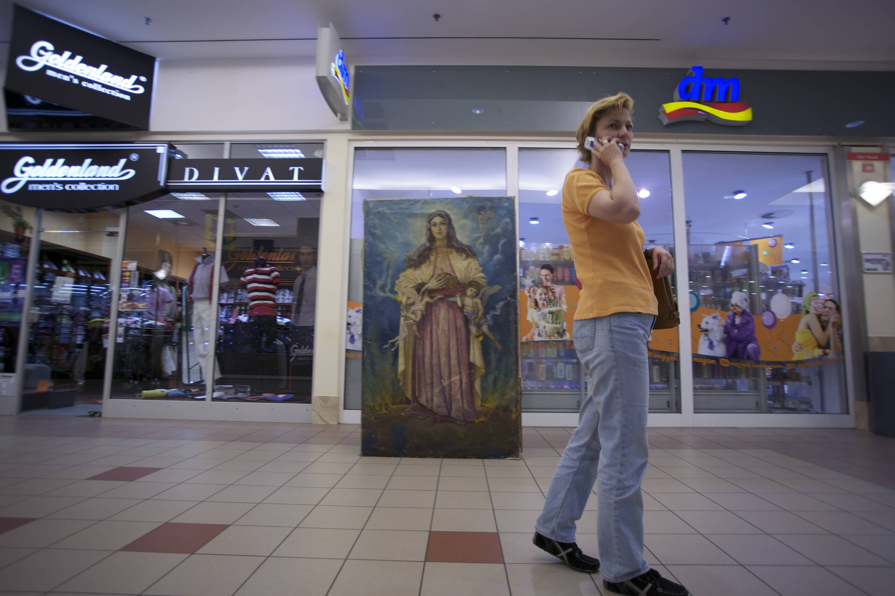
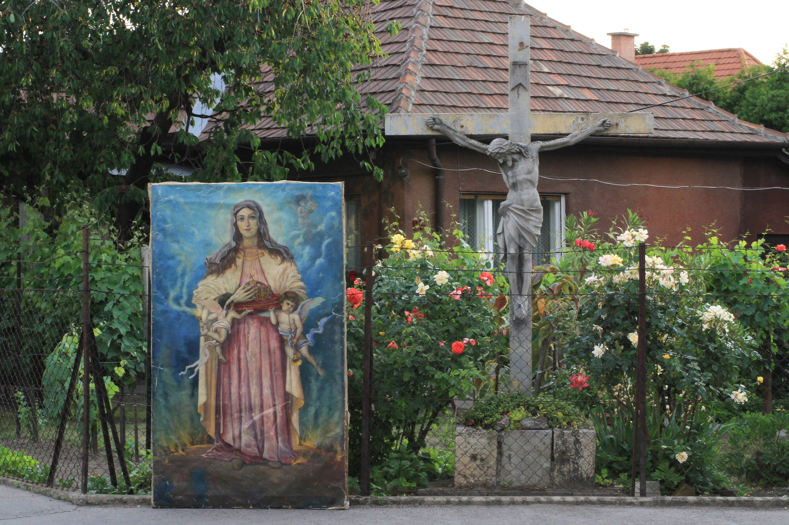

<!-- {
    "img": "bed_from_the_cottage/mary_hobo_0.jpg",
    "title": "Ágy a házikóból / Bed from the cottage",
    "desc": "The city really no longer contains distinct private and public spaces"
} -->

# Ágy a házikóból
**Bed from the cottage**

I’ve been exploring the borderlines between the public and the private space. I used an ordained altar picture of Virgin Mary which is my family’s property. When I was a child, it was hanged in our room but later we moved it up to the attic and we moved from that house. Now I went back there and brought down the painting and tried to find out where does it really belong and how does it behave in certain situations.

> The city really no longer contains distinct private and public spaces

Vilém Flusser / The City as Wave-Trough in the Image-Flood

> Public space (broadly defined) relates to all those parts of the built and natural environment, public and private, internal and external, urban and rural, where the public have free, although not necessarily unrestricted, access. It encompasses: all the streets, squares and other rights of way, whether predominantly in residential, commercial or community/civic uses; the open spaces and parks; the open countryside; the ‘public/private’ spaces both internal and external where public access is welcomed – if controlled – such as private shopping centres or rail and bus stations; and the interiors of key public and civic buildings such as libraries, churches, or town halls

Matthew Carmona – Caudio de MAGALHAES – Leo Hammond  
Public Space: The Management Dimension

### Text by my mother, Dr. Sarolta Kovácsy:

> Zoltán Váry Vojtovics painted this painting in 1941. The painting shows Hungary’s patron, Maria standing on a globe which is interestingly in flames. He started to paint war-related pictures at that time. Váry entrusted Maria to help Hungary in the war. She holds the crown in her hands on a velvet pillow. This particular painting was made for an altar-piece in a church made by Migazzi in Veresegyház. In the 50s as there was no hammer and sickle emblem on it, they sold and delivered the painting to Mesztegnyő with a farm-wagon. It was used as an altar-piece there.
> 
> When I became a medical student and later when I finished my studies, my mother and my grandmother always cried about how they’d lost their religious properties. I decided to write a letter signed as Dr. Kovácsy Sarolta so they thought I’m a lawyer and they immediately sent the painting back by train to Rákospalota. Later on the thieves couldn’t steal it because it’s such a huge piece it wouldn’t pass through a double-sided door either.
> 
> The frame arrived highly damaged so we got a fair amount of money for it from the insurance company. It was a Blondel frame, around 40 cm wide. The painting was placed in our house, and it’s still there. We got lots of paintings stolen from there, we had several burglaries but the Maria painting is still there. Olga used to sleep underneath it when she was a little girl, and who thought she would eventually produce her degree work about this piece.

### Materials:
| | | |
|-|-:|:-|
|oil painting: 200 x 120cm|&nbsp;2&nbsp;|red flower carpet|
|photo on dibond:|&nbsp;1&nbsp;|orion tv|
|75 x 50 cm x10 pieces|&nbsp;1&nbsp;|glass house with plastic roses and a ceramic rabbit|
|37,5 x 50 cm 1 pieces|&nbsp;1&nbsp;|rabbit headphone|
|photo on canvas 60 x 80 cm with vintage blondel frame|&nbsp;2&nbsp;|rabbit speakers|
|video: 2’40” 960x540 MOV|&nbsp;1&nbsp;|vintage red flower carpet chair|
| |&nbsp;1&nbsp;|vintage red flower carpet bed|

&nbsp;

One photo from the series depicts a homeless man. While he was sleeping I placed the painting behind him. I would have been really sorry if he never knew this so later I printed the photo and delivered it to him.

<iframe full="true" title="vimeo-player" src="https://player.vimeo.com/video/25047003?h=852581ae05" width="640" height="360" frameborder="0" allowfullscreen></iframe>

## [Back to exhibitons](/c/exhibitions)