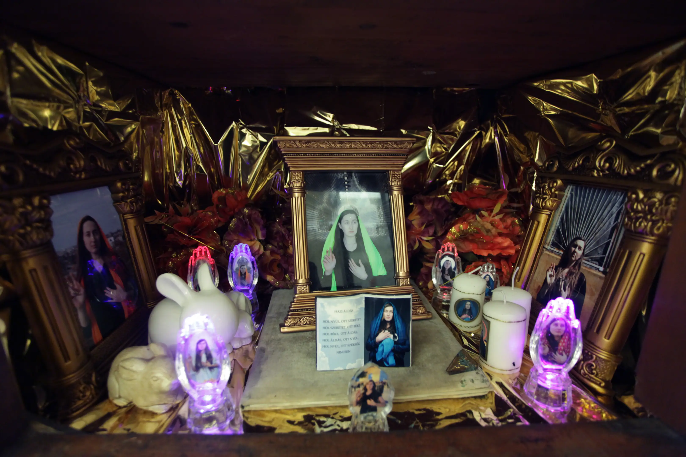

<!-- {
    "img": "projects/cabinet_from_the_cottage-2012/DSC04655.jpg",
    "title": "Cabinet from the Cottage (2012)",
    "desc": "**{TODO: description}**"
} -->

# Cabinet from the Cottage
**Szekrény a házikóból**  
**{TODO: where?}** (2012)

The installation consists of a modified Beidermeier cabinet. In its side panels there are two small chambers, where the visitors can sit inside and watch a short movie. In that movie my mother speaks about our House, where I grew up. Her voice is over a slow motion video, what looks like a still image at first.

In the middle of the cabinet there is a showcase for kitschy Holy Olga relics and pictures. They surround the real memories, known from the video: a key, some hair and a plastic soldier. The act of giving is important for me, so the visitors can take home some stickers and photos from the lower drawer of the cabinet.

* size: 208 x 186 x 64 cm
* weight: 60kg
* video: 6 min 57 sec, PAL
* mixed media installation

<iframe full="true" src="https://player.vimeo.com/video/48556634?h=b6257745fd" width="640" height="360" frameborder="0" allow="autoplay; fullscreen; picture-in-picture" allowfullscreen></iframe>

## The story what my mother tells in the video:

> This house was built in 1933, and now it's really old, because we we're in the year of 2011. The curiosity of this house is, that a 22 months old little boy was buried in the garden, who had blond curls. His name was Kálmánka. He's been shot into pieces while my mother was holding him in her arms, at the back of the terrace of the house. It's located near the railway and there were hand-to-hand fights during the war. The Germans and the Russians were fighting each other, every way they could, including using civilians.  
&nbsp;  
Now then, the family at that time lived in a bunker in the vicinity of Erdőkertes and Veresegyház villages. But they came home for Christmas. When they arrived they saw that the furniture was not taken away. How's that? They were carpet-bombing Rákospalota and it looked miraculous that the furniture survived. After we came home, we lived in the basement here too.  
&nbsp;  
My father was drafted. Ohh Me. My mother, me and my brother were in the basement in Rákospalota, the basement which was under our house. Somebody knocked on our door. My mother went up, because at that time, who didn't react, or didn't open the door, faced salvo fire *\[a short burst of rapid gunfire from the patrolling squad.\]*. They killed five people in the back terrace with a grenade, as the terrace was opened. Kálmánka grabbed my mother’s skirt. He was 22 months old. And his cerebellum *\[part of the brain\]* and scruff was injured by the grenade.  
&nbsp;  
He was dying 28 or 24 hours in the Árpád Hospital. My mother brought him there crawling face down. At the hospital they said if he survived he would had problems with walking, movement and speaking because of the injurries he suffered at the cerebellum. There would have been problems so he would have become a disabled person. We kept his beautiful curly little hair. Even, it is arranged next to Philadelphia’s town key, next to the golden key sitting on the blue velvet, the hair they cut off.  
&nbsp;  
They buried him into the garden. My father came home for the burrying. Now that's mention worthy because if he didn't come for the funeral, in which the entire street took part, he would have fallen to his death at Chain Bridge. His squadron was perished there, when the Chain Bridge collapsed. The Germans exploded the Chain Bridge at the moment the soldiers were marching on it.  
&nbsp;  
Now, when Kálmánka was catafalqued in a little tubby thing and they were digging his grave at the back of the garden, he was buried with toy soldiers he's got as a Christmas presents. My father's hair got grey under 24 hours. I learned in physiology this is impossible, there's no such a thing. They lower the shutter in the evening, and the next morning when they pull it up, the handsome blonde-brown haired man became a snow-white old person.  
&nbsp;  
Well, when he died at the age of 86 he still had a wonderful beautiful long white hair, and white beard. For me, My father was the masculine-ideal, he was a pentathlonist beautiful man. We've got a hart shaped red electric-meter. It has too the sparks of the countless shots, and grenades, inflicted by the close encounters around the house.  
&nbsp;  
We had a dog, who was always sitting on Kálmánka’s grave. Practically the dog was loyal. He died with the 22 months old little boy in his sorrow on the top of the grave. Well, that's the kind of house you live in. This has taken a lot out of my parents' life. My father was a factory worker in Csepel, although he was a graduated man. After that he worked here at the 15th district’s tax office, previously it was called Council of Rákospalota.  
&nbsp;  
Also my mother was a social worker. She worked for 16 years here for the Mayor’s office of Rákospalota. Well, you are the child of an old girl. I was born in 1944 and well I gave birth to you in 1987. There was a forerunner in 1986, called Sacika. Well, the pair of you were born into this hoopla. My father died at the age of 86 in 1989. My mother died in 1994.  
&nbsp;  
As a matter of fact, losing both of them was incredibly hard for me, while we had all the burglers on top of that. They've stolen all the valueables we have had one-by-one. Because I was working day-and-night, so I could put food on the table. My mother and my father were on the edge between the living and the non-living for 15 years. They were sometimes concious, sometimes not but then by all means, they were both broken and fractured people. They could never get over what happened to them. That’s why I am strongly advocating peace. I don’t like things like war or similar.  
&nbsp;  
I think I gave both of you an honorous upbringing, Saci and Olgi too. I feel like Olgi brings that flame in herself, that fire. Because I also had some affinity for fine art. And Olga’s perspective left a mark on everything. There was this alley of fir trees in the garden witch was bought at a World Exhibition from the doorman for 10 pengő *\[old Hungarian currency\]*. We had like ten big fir trees. The fir trees were huge, when we needed them to be cut of they were already more than 70 years old. It was a God’s miracle that they didn't smash the house. They were horribly tall, big cross-sectioned, ominous trees. A young blonde man could only chop them off so it had only 5 centimeters room to crack on the fence, but they didn't damage the house.  
&nbsp;  
It felt like a bomb fell. Neighbours could feel the thump of the huge trees even at the end of the street. Here you live on a street which have sycamore tree alley with 100 trees. There were you, a blond curled haired little child. You were sitting under the purple locust tree greenery on a white bench. That was the environment you grew up in. You had a little bunny too.  
&nbsp;  
Well, this is how our life looks like. What else should I tell you more about what has been? You lived in it, you experienced it. We are not of the common folk. It's hard to endure the world like how it is.

## [Back to projects](/c/projects)