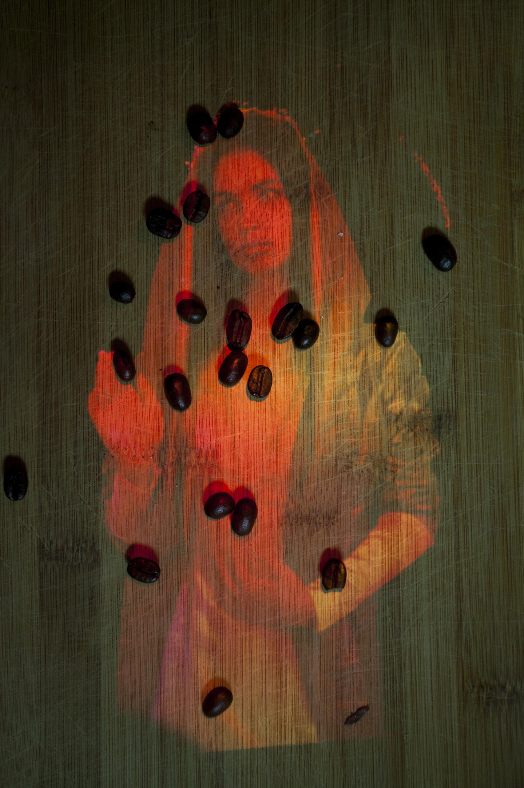
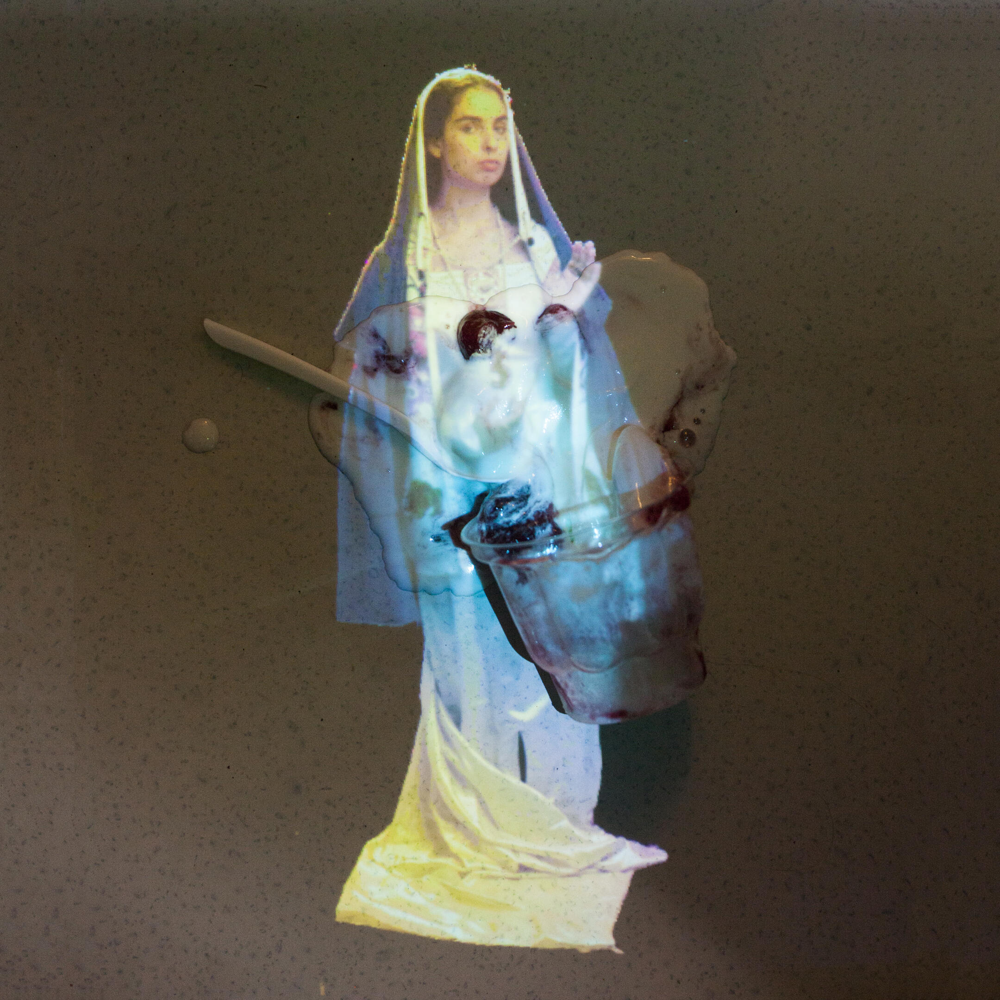
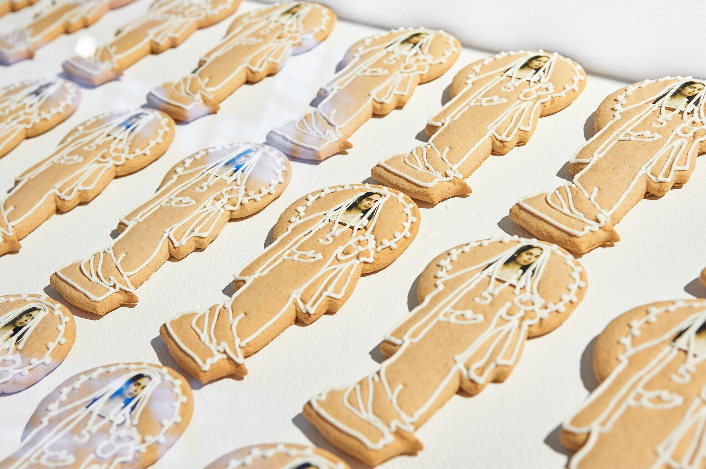
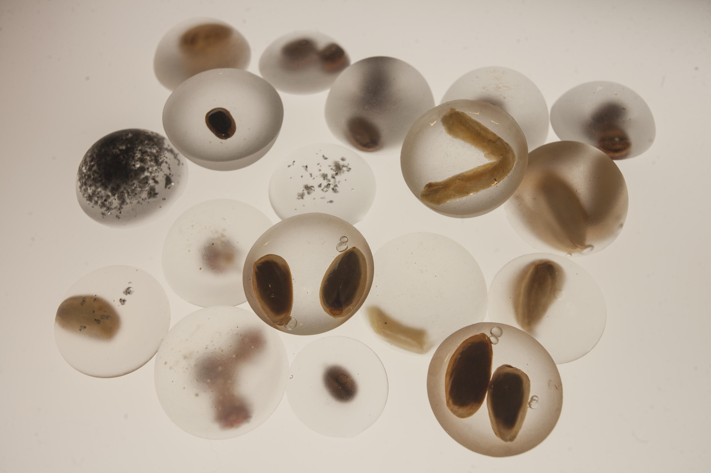
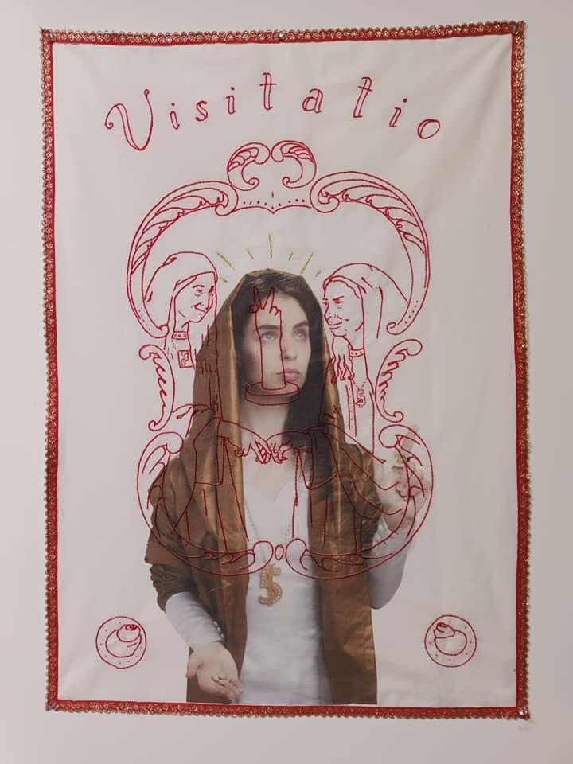
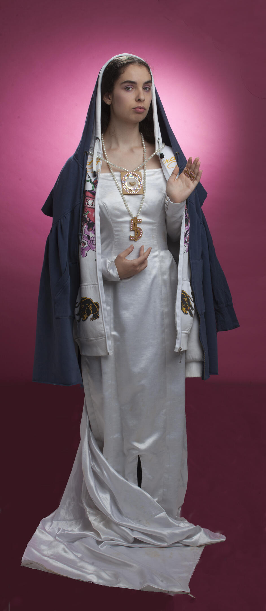
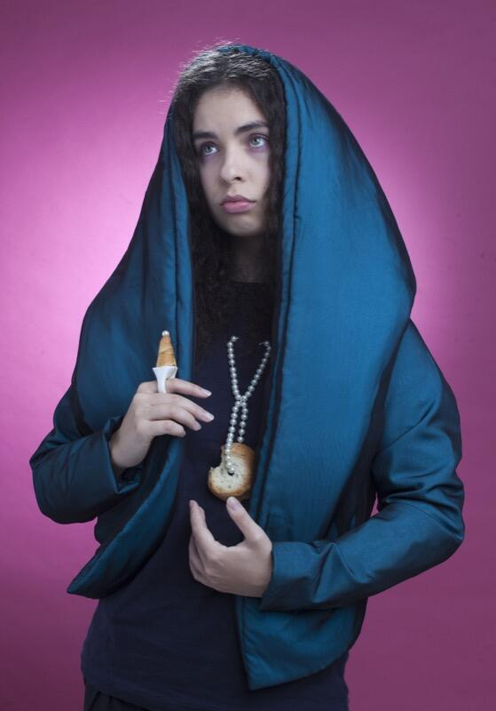
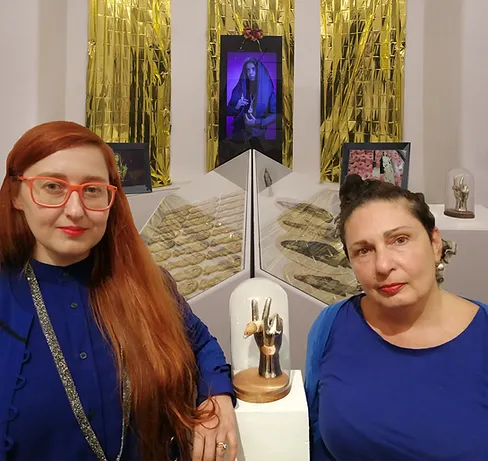
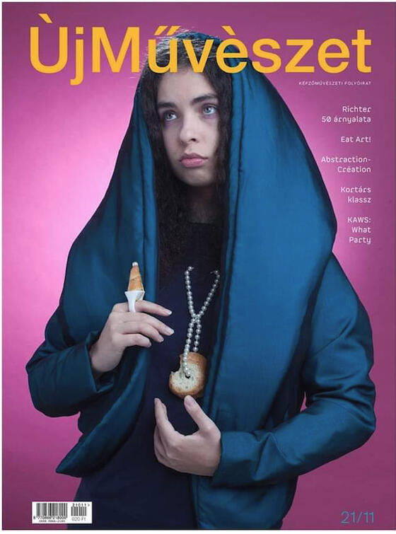
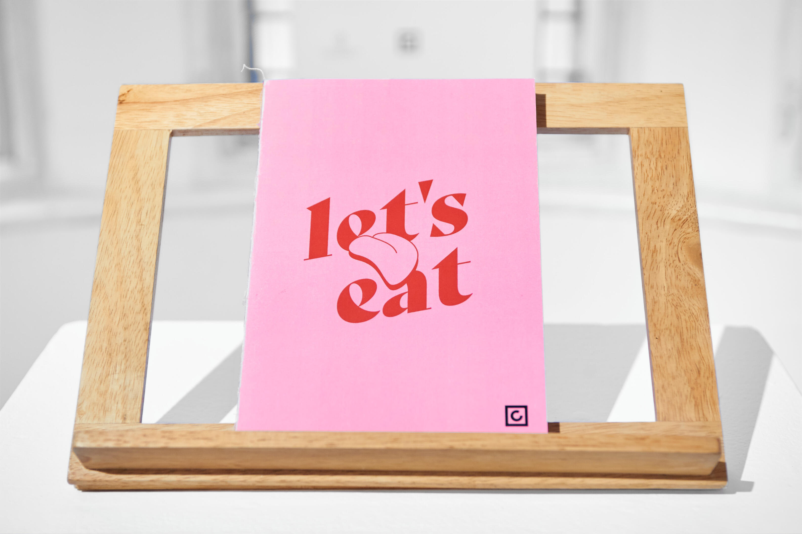

<!-- {
    "img": "zoltai-2022/zoltai02.jpg",
    "title": "The Patron Saint of Fallen morsels (2021)",
    "desc": "Collaboration with Eszter Ágnes Szabó"
} -->

## The Patron Saint of Fallen morsels
**Leesett falatok védőszentje**  
Collaboration with *Eszter Ágnes Szabó* [@](https://secondaryarchive.org/artists/eszter-agnes-szabo/) [@](https://www.ludwigmuseum.hu/alkoto/szabo-eszter-agnes)  
2021 - Ongoing

Scientists have experimentally proven that food immediately becomes dirty as soon as it hits the ground, and microorganisms wait no time. If you drop a bun in water, it gets wet right away; if you drop it into mud, it’s instantly covered in mud. Why would it happen otherwise when it comes to dirt? In fact, we want to believe that food can be recovered.

The five-seconds window is a sacral time while you process the loss and make a decision whether you want to save the food from premature decay or leave it to its doom. The five-seconds rule thus exists and does not exist at the same time. It is merely the product of the imagination, a transition between being and non-being, and a slot where you can intervene according to your beliefs. But those who consider consuming food from the ground will not be left to themselves, because IRMA5SECOND, the patron saint of fallen bites, will appear before the hesitant, support them in their belief, and transfigure their spoiled snack.

It is her character that we are working on.

## THE EMBODIMENT

<irmagraph></irmagraph>

UV print, steel plate, 200x100cm x 1,5mm  
weight: 24kg

## Visitatio
Meeting of two Artists

1. exemplary model
2. extraordinary teacher
3. wonder worker or source of benevolent power
4. intercessor
5. a life often refusing material attachments or comforts
6. possession of a special and revelatory relation to the holy

## Printed Press:

### ÙjMűvészet 21/11

### Let's EAT 10

## Online press:

<cardlink href="https://www.godot.hu/kocsiolgaszaboeszteragnes-godot-katalizator-dij-heterotopia"></cardlink>

[Kocsi Olga & Szabó Eszter Ágnes / Godot-Katalizator-díj / Heterotopia / Kiállítás - Godot](https://www.godot.hu/kocsiolgaszaboeszteragnes-godot-katalizator-dij-heterotopia)

## [Back to projects](/c/projects)