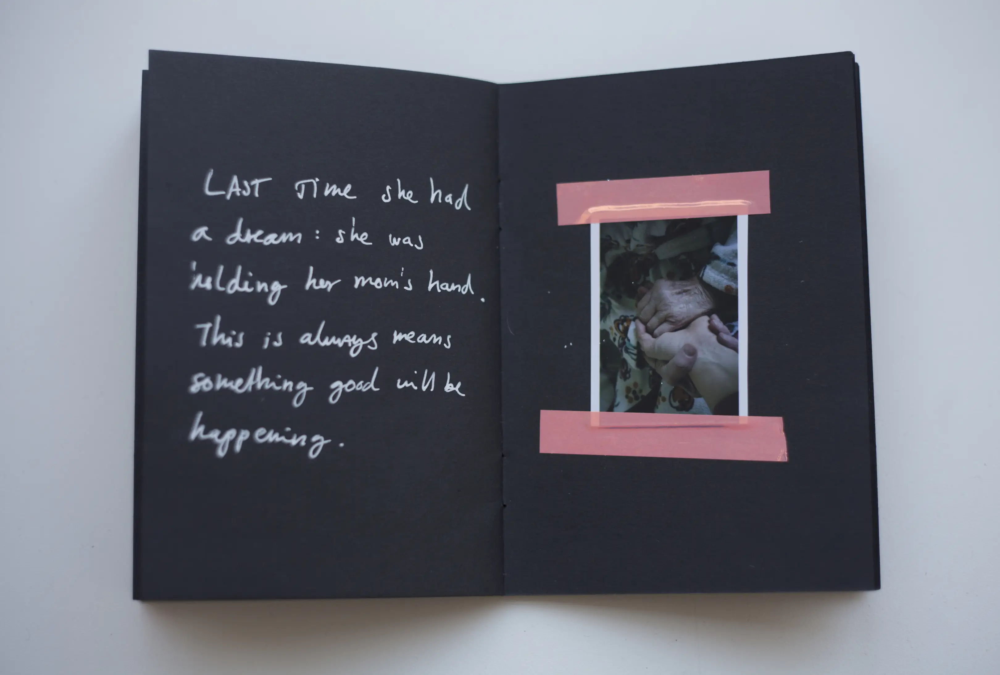

<!-- {
    "img": "negatives_from_mama_rose_life-2019/3.webp",
    "title": "Negatives from Mama Rose's life",
    "desc": "**{TODO: Generate description}**"
} -->

## Negatives from Mama Rose's life
**MAGNUM Pop-Up exhibition**, CAPA Center, Budapest, Hungary, 2019

I've got the opportunity to join the MAGNUM photo workshop, organized by the CAPA center. I could work on new materials during this tight and intensive one-week program. I decided to make some changes to the initial concept **{TODO: what was the initial concept?}**: I started to pay even more attention to Mama Rose focusing less on the hospital setting **{TODO: where does this hospital setting come from?}**. The outcome was a photo-booklet and an installation with the photo-negatives about the 94 years-old lady.

I brought her dream to life: The walk of the sinister cat **{TODO: what is this dream?}**. I created both digital and analog materials (latter was done mostly with Instax cartridges), which then I glued in a small black booklet. I also added some text besides them. Mama Rose took care of me and my sister a lot when I was a kid. Previous year she’s got hospitalized on Easter, and she hasn’t recovered since. I visit her frequently. **{TODO: mention she passed away?}**

## [Back to projects](/c/projects)