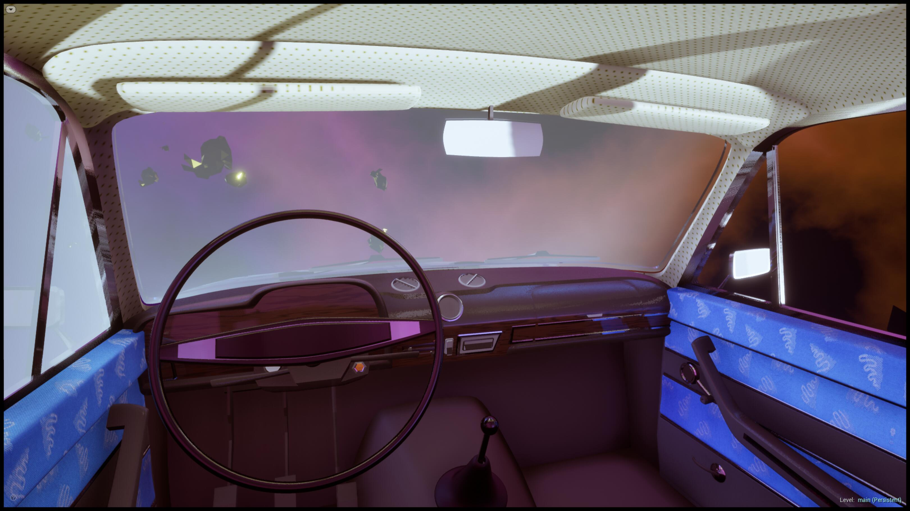
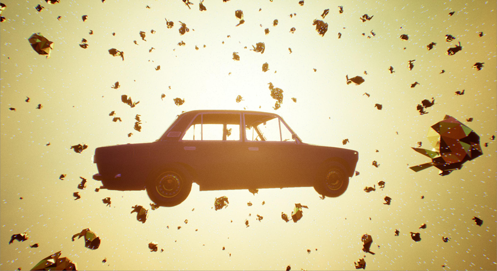
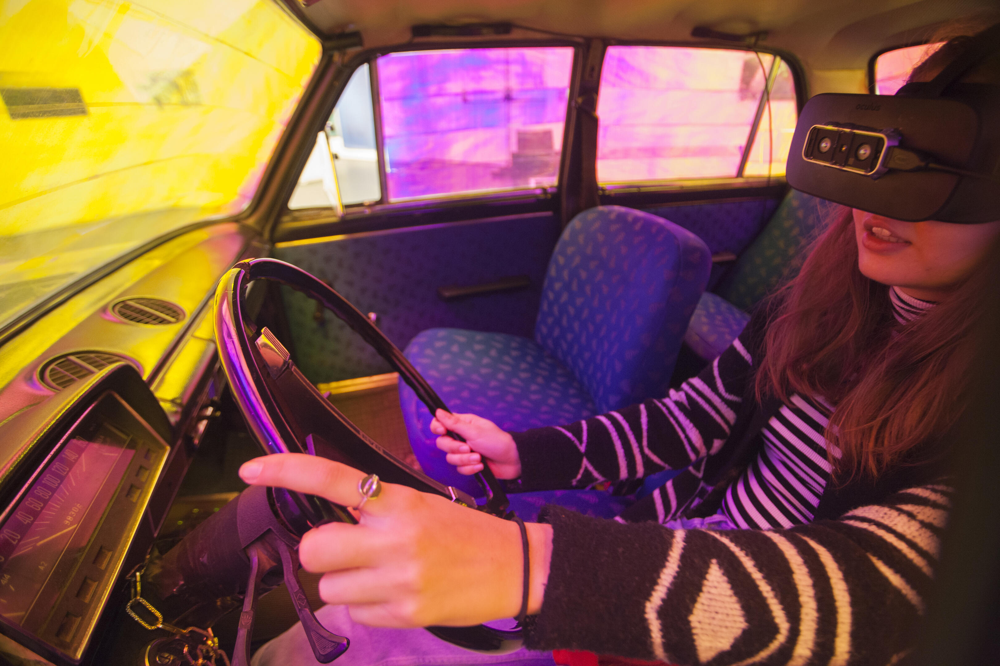
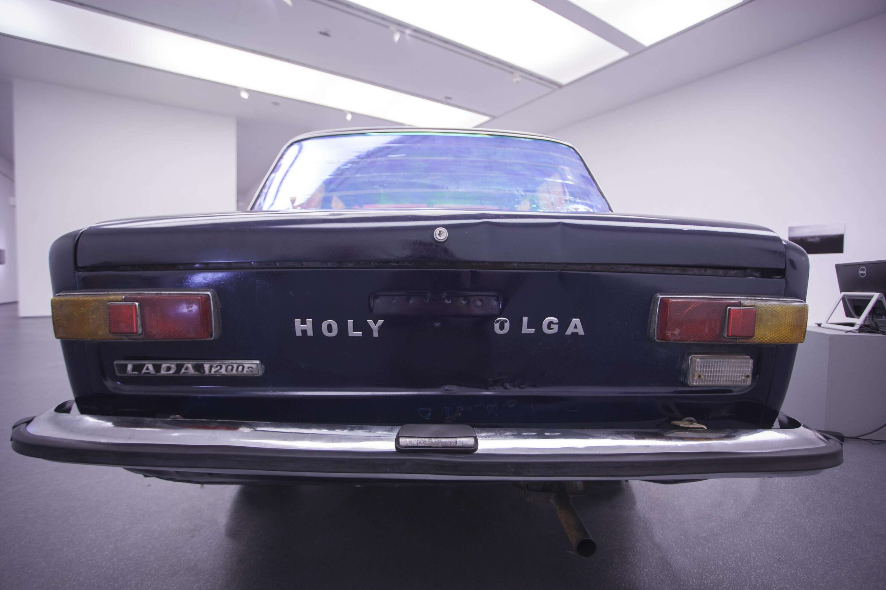
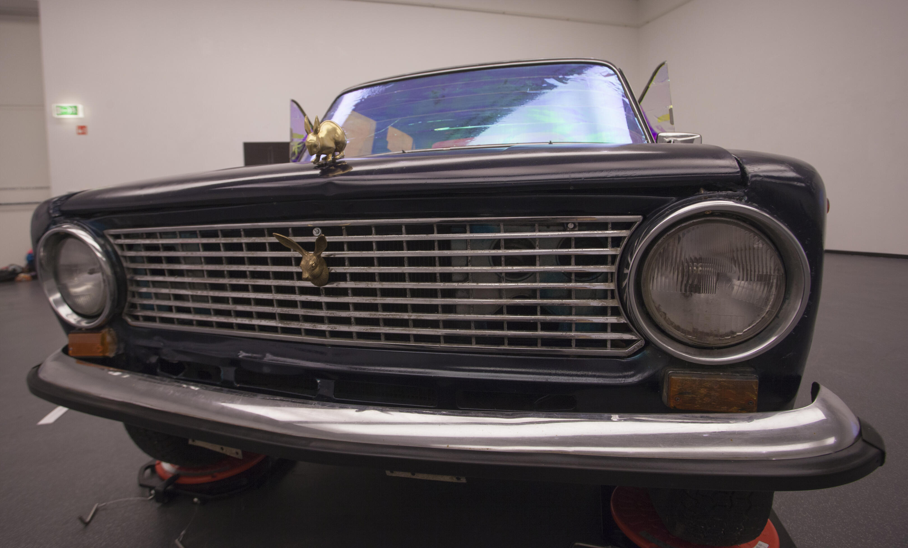
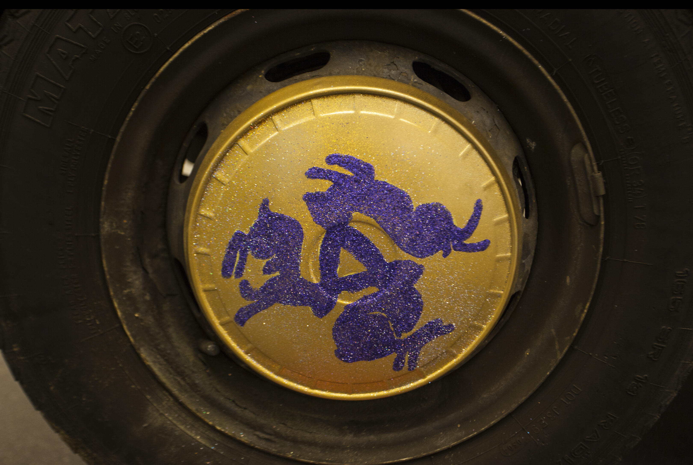
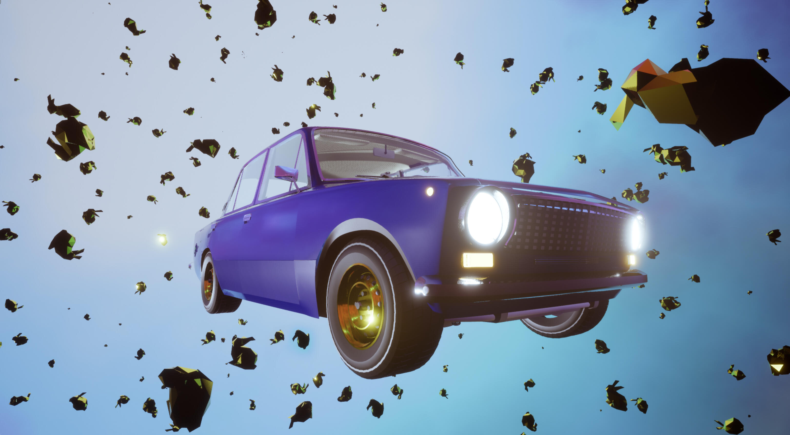

<!-- {
    "img": "vr_lada-2017/VR_LADA_inside.jpg",
    "title": "VR LADA (2017 - 2019)",
    "desc": "Drive a LADA car in the hare universe"
} -->

# VR LADA
**Mélyvíz**, M21 Gallery, Pécs, Hungary 2017  
**Küszöb fesztivál**, AQB, Budapest, Hungary, 2018  
**Museum TV**, PhotoIreland, 2019

We’re in the universe of emptiness and void, going along the paths of a Möbius space in a twisted reality. I brought my mother’s blue LADA 1200 made in 1987 into the virtual reality. Visitors can get into the car, put the VR glasses on and they’ll be part of the hare-universe. The LADA can be controlled with the steering wheel and its gas- (go forward), transmission- (turn up) and brake pedals (turn down). Golden rabbits are floating around the VR LADA in an imaginary dimension while the sounds of our Little house and the voice of my Mother fill the universe. The LADA itself is floating in an illusion where memories are created via travelling back into the past. An endless wandering, our Little house is present but only in sound somewhere in this timeless void.

This project wouldn’t have been realized without the involvement of these experts:

| | |
|-:|:-|
|Dávid Mórász:|programming|
|Kálmán Tarr:|microelectronics
|Péter Faul:|sound design|
|The original owner of the LADA:|Dr. Sarolta Kovácsy, my mother.|

&nbsp;

<iframe full="true" src="https://player.vimeo.com/video/252032727?h=503a50e647" width="640" height="360" frameborder="0" allow="autoplay; fullscreen; picture-in-picture" allowfullscreen></iframe>

## Materials
* LADA 2101 Car
* VR Headset: Oculus Rift
* Leap Motion (now called Ultraleap)
* Computer
* Screen
* microelectronics
* Sensors
* Arduino
* video documentation: 2' 34" FullHD

## Press

<cardlink href="https://artportal.hu/magazin/aldott-ladakat-moma-ba/"></cardlink>

<cardlink href="https://museum.photoireland.org/programme-2019/museumtv/"></cardlink>

## [Back to projects](/c/projects)
