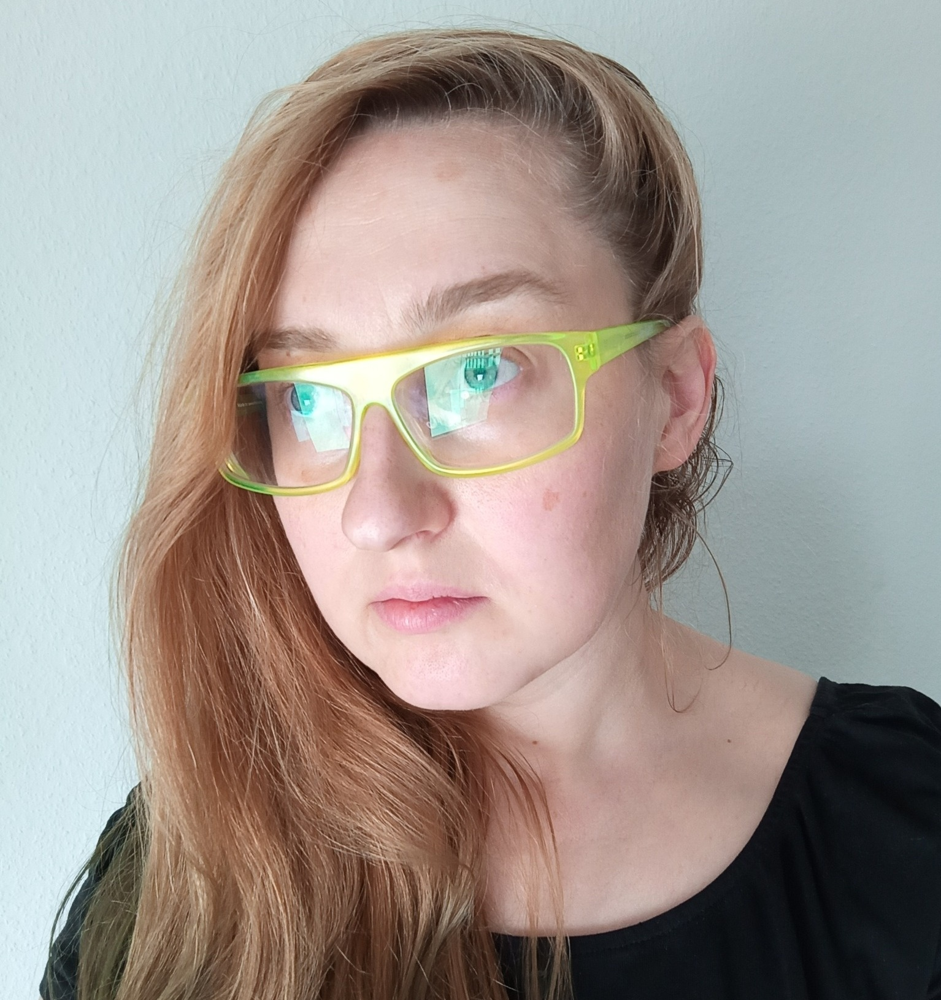

## About me

### Studies

|   |   |   |
| - | - | - |
| 2018-2021 | **ÉSZC Csonka János Vocational School** | ***Auto body technicians***, Szigetszentmiklós |
| 2016-2018 | **Computer School Vocational School** | ***Electrician***, Budapest |
| 2013-2016 | **Moholy Nagy Art and Design University** | ***Multi-Media Artist, DLA absoltorium***,  Budapest |
| 2012-2015 | **Moholy Nagy Art and Design University** | ***Visual Art and Design Teacher, MA degree***,  Budapest |
| 2011- 2013 | **Moholy Nagy Art and Design University** | ***Media design, MA degree***, Budapest |
| 2011 | **Willem de Kooning Academy** | ***Audio Visual department***, Rotterdam
| 2008-2011 | **Moholy Nagy Art and Design University** | ***Media design, BA degree***, Budapest |

### Scholarships, grants

|   |   |
| - | - |
| 2019 | Budapest Portfolio review FUTURE  talent, Capa Center |
| 2019 | Budapest Portfolio review MAGNUM workshop scholarship, Capa Center |
| 2017-2019 |	Derkovits Gyula hungarian art scholarship |
| 2013 | Bridge Budapest Fellowship , San Francisco |
| 2013 | Hungarian National grant for scholarship DLA studies |
| 2013 | Rector's award,  best diploma at MOME  |
| 2013 | ESSL ART AWARD CEE, nominee |
| 2012 | Hungarian Republic scholarship |
| 2011 | Erasmus scholarship, Rotterdam |

### Memberships
|   |   |
| - | - |
| 2015 -2016| President of Doctoral Student Council at MOME |
| 2015 -2016| Doctoral Student member of Seant of MOME |
| 2012 | FKSE Studio of Young Artists’ Foundation, membership |
| 2010 -2013| Student Union at MOME |
| 2010 -2013| Student member at Senat of MOME|

### Workshops

| | |
|-|-|
| 2020 | Capazine Let's Eat at Capa Center **Budapest** |
| 2020 | Live Coding Camp, Zipernowsky Stúdió, **Budapest** |
| 2019 | MAGNUM PHOTO, CAPA központ, **Budapest** |
|  | KÖZKEMP, **Erdőbénye** |
|  | Chaos Communication Camp, Numberwang village, pancake participant, **Berlin** |
|  | FUTURE TALENT  online tutoring with **PhotoIrland** with Ángel Luis González |
| 2018 | Capazine Let's Play at Capa Center **Budapest** |
| 2015 | MOME BÓJA **Tihany** |
| 2012 | Island CQ 2012 **Latvia** |
| 2012 | Museum pedagogy workshop with Leonardo program **Lisbon** |
| 2011 | Mezőszemere Art camp with Imre Bukta, **Mezőszemere** |

### In public collection

* mama Rose, installation,  2019, **Modem-art collection, Debrecen**
* Concrete-icon, pigmented concrete-print 2017, **Museum Kiscell / Municipal Gallery, Budapest**

### Teaching

| | |
|-|-|
| 2019 | Lecturer for students at Medgyessy Ferenc High School **Debrecen** |
| 2015-2017 | Moving image Artist Teacher, KISKÉPZŐ Secondary School of Visual Arts  **Budapest** | 
| 2016 | Time and Concrete workshop at MOME curse week with Péter István Varga **Budapest** |
| 2016 | Lecturer at  Flying art course **Debrecen** |
| 2015-2016 | Cogitani math and art workshop for kids with Luca Szegletes, **Budaörs** |
| 2015 | Internship as Art Teacher at Mihály Fazekas High School, **Budapest** |
| 2014 | Internship as Art Teacher at KISKÉPZŐ Secondary School of Visual Arts **Budapest** |
| 2014 | Internship in Museum Pedagogy at Ludwig Museum **Budapest** |

## [Artist Teacher Portfolio here](https://issuu.com/heldin/docs/kocsi_olga_portfolio_tanar_kicsi_ma)
 

## [Appearances in Press](/c/press)

### Contacts:

* kocsi.olga@gmail.com / nyulga@nyulga.com
* [Join us on Facebook](https://web.facebook.com/Holy0lga)
* [Instagram](https://www.instagram.com/holy_olga/)
* [Twitter](https://twitter.com/nyulga)