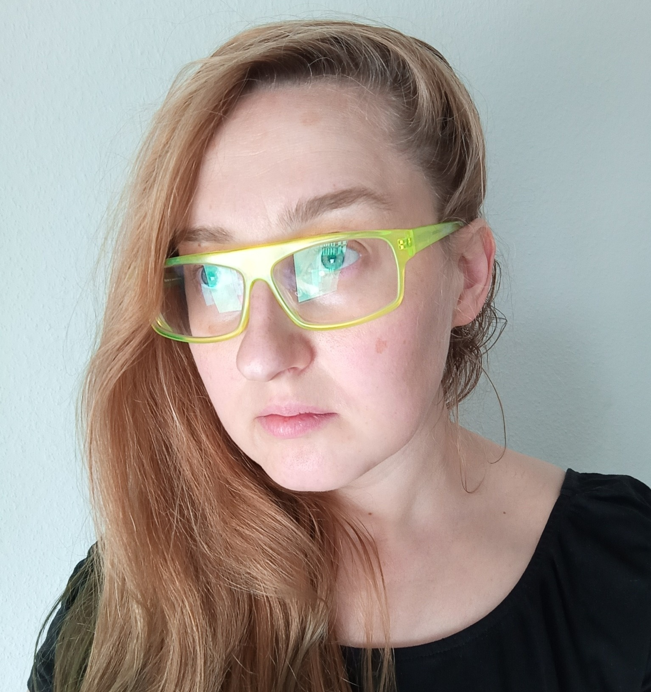

### Contacts:

* [kocsi.olga@gmail.com](mailto:kocsi.olga@gmail.com)
* [Join us on Facebook](https://web.facebook.com/Holy0lga)
* [Instagram](https://www.instagram.com/holy_olga/)
* [Twitter](https://twitter.com/nyulga)

### Studies

|            |                                              |                                                              |
| ---------: | -------------------------------------------: | :----------------------------------------------------------- |
|  2021-2022 |                                 **FREESZFE** | ***Performance and Theater***, Budapest                   |
|  2018-2021 |         **ÉSZC Csonka János** Voc. School | ***Auto body technicians***, Szigetszentmiklós            |
|  2016-2018 |           **Computer School** Voc. School | ***Electrician***, Budapest                               |
|  2013-2016 | **Moholy Nagy Art and Design** University | ***Multi-Media Artist, DLA absoltorium***,  Budapest      |
|  2012-2015 | **Moholy Nagy Art and Design** University | ***Visual Art and Design Teacher, MA degree***,  Budapest |
| 2011- 2013 | **Moholy Nagy Art and Design** University | ***Media design, MA degree***, Budapest                   |
|       2011 |             **Willem de Kooning** Academy | ***Audio Visual department***, Rotterdam                  |
|  2008-2011 | **Moholy Nagy Art and Design** University | ***Media design, BA degree***, Budapest                   |

### Scholarships, grants, awards

|           |                                                                                                                                                                                                                |
| --------: | :------------------------------------------------------------------------------------------------------------------------------------------------------------------------------------------------------------- |
|      2024 | [Kassák award finalist](https://kassakmuzeum.hu/hu/hirek/hirek/kassak-kortars-muveszeti-dij-dontosei)                                                                                                          |
|      2024 | [HAB award](https://kultura.hu/kocsi-olga-nyerte-el-a-hab-dijat/) - Hungarian Art and Business                                                                                                                 |
|      2022 | [BME Art Residency Program](https://rezidensmuvesz.bme.hu/hungarian-resident-artists-2022-2023/), Budapest                                                                                                     |
|      2022 | [Godot G.I.C.A award finalist](https://www.godot.hu/post/godot-katalizator-dij-2022-nyertesek), Audience award                                                                                                 |
|      2022 | [Budapest Gallery, artist exchange](https://www.donumenta.de/en/world-heritage-revisited/air-artist-in-residence-program/olga-kocsi-intermediate-tones/), Regensburg residency                                 |
|      2021 | [Leopold Bloom](https://www.leopoldbloomaward.com/index.php?searchenginerUrl=jeloltek%2F2021&language=en&language=en) art award shortlist                                                                      |
|      2021 | [Life Long Burning Residency](https://archive.lifelongburning.eu/projects/events/e/residency-nora-barna-and-kocsi-olga-piroska.html) at ICI-CCN de Montpellier                                                 |
|      2019 | Budapest Portfolio review [FUTURE talent](https://www.futures-photography.com/profile/olga-kocsi), [Capa Center](https://blog.capacenter.hu/2019/10/21/the-futures-talents-of-capa-center-in-2019-olga-kocsi/) |
|      2019 | Budapest Portfolio review [MAGNUM workshop scholarship](https://capacenter.hu/en/budapest-portfolio-review-2019-result/), Capa Center                                                                          |
| 2017-2019 | [Derkovits Gyula hungarian art scholarship](https://exindex.hu/hu/hirek/derkovits-osztondij-2018/)                                                                                                             |
|      2013 | [Bridge Budapest Fellowship](https://bridgebudapest.org/fellow_posts/olga-kocsi-the-journey-of-a-rabbit-and-an-unicorn/) , San Francisco                                                                       |
|      2013 | Hungarian National grant for scholarship DLA studies                                                                                                                                                           |
|      2013 | Rector's award,  best diploma at MOME                                                                                                                                                                          |
|      2013 | [ESSL ART AWARD](https://archivum.maimanoarchiv.hu/andrekerteszterem/20130516_essl/index_en.html) CEE, nominee                                                                                                 |
|      2012 | Hungarian Republic scholarship                                                                                                                                                                                 |
|      2011 | Erasmus scholarship, Rotterdam                                                                                                                                                                                 |

### Memberships
|            |                                                      |
| ---------: | :--------------------------------------------------- |
| 2015 -2016 | President of Doctoral Student Council at MOME        |
| 2015 -2016 | Doctoral Student member of Seant of MOME             |
|       2012 | FKSE Studio of Young Artists’ Foundation, membership |
| 2010 -2013 | Student Union at MOME                                |
| 2010 -2013 | Student member at Senat of MOME                      |

### In public collection

* [Beton icon 7x7](/c/art/beton_ikon_7x7), concrete pigmented icon 49 piece, 2024,  **HAB - Hungarian Art and Business**
* mama Rose, installation,  2019, **Modem-art collection, Debrecen**
* Concrete-icon, pigmented concrete-print 2017, **Museum Kiscell / Municipal Gallery, Budapest**
* Holy Olga, photo etching on paper, 2011,  **Museum Kiscell / Municipal Gallery, Budapest**

### In public space:

* Visual Memory of the Fires of Debrecen, Data Physicalization, 2023, **Debrecen**

### Solo Exhibitions

|      |                                                                                                                                                   |
| ---: | :------------------------------------------------------------------------------------------------------------------------------------------------ |
| 2025 | aug Story of László Follajtár, collab with Ádám Schór, ISBN+ Gallery, Budapest                                                                    |
| 2024 | Beton Icon 7x7 sneak peak, Museum Night, HAB- Hungarian Art and Business, Budapest                                                                |
| 2020 | [Rákóczi Legendary](/c/art/raakooczi_legendarium-2020), ISBN Gallery, Budapest                                                                    |
|      | House of Holy Olga - future telling installation, Ikon-day, Jurányi, Budapest                                                                     |
| 2019 | Time print - FKSE studio Gallery, Budapest                                                                                                        |
|      | House near the lake - installation, happening, performance, Bánkitó festival, Bánk                                                                |
| 2018 | [VR LADA](/c/art/vr_lada-2017) - Zhiguli on the rooftop - Küszöb fesztivál, AQB, Budapest                                                         |
|      | [Holy Olga: Golden Rabbit](https://www.youtube.com/watch?v=6LauZ1mR2sk&feature=youtu.be), happening, Kolorado festival, Nagykovácsi               |
| 2017 | Holy Olga: Let there be light, solo show, Lollipop gallery, Budapest                                                                              |
| 2016 | House of Holy Olga - solo exhibition, Csili, Pesterzsébet                                                                                         |
| 2015 | Rabbit dinner - happening, FKSE projekt room, Budapest                                                                                            |
|      | Everyday Holyday - workshop installation at  Sziget Fesztivál, Budapest                                                                           |
| 2014 | [Journey to Happiness](https://vimeo.com/103221894?msockid=1fa747a697e860b82e72526c969b611c) - workshop installation at Sziget Festival, Budapest |
|      | Almost nothing can be almost everything, [Chalk room Jurányi](https://juranyihaz.hu/hu/hir/kocsi-olga), Budapest                                  |
| 2012 | [Bed from the Cottage](/c/art/bed_from_the_cottage) , solo exhibition, Casati Gallery, Budapest                                                   |

### Conferences
|      |                                                                                                               |
| ---: | :------------------------------------------------------------------------------------------------------------ |
| 2025 | [The Subtle Art of Invisible Work, TEDxBME](https://www.tedxbme.hu/speakers)                                  |
| 2023 | [Invisible work, EELISA,  Bucharest](https://eelisa.eu/when-arts-meet-science-at-bmes-art-residency-program/) |
| 2023 | [The sensual semblance of data, MODEM](https://modemart.hu/program/az-adat-erzeki-latszata/)                  |

### Selected group exhibitions

|      |                                                                                                                                                                                                                                                  |
| ---: | :----------------------------------------------------------------------------------------------------------------------------------------------------------------------------------------------------------------------------------------------- |
| 2025 | No string attached, group exhibition, Budapest Photo Festival, Brody House, Budapest                                                                                                                                                             |
| 2024 | Capazine Let’s Roll fanzine + workshop, collab with Ádám Schór, Capa Center, Budapest                                                                                                                                                            |
|      | [Miracle, group exhibition, collab with Ágnes Eszter Szabó](https://ujmuveszet.hu/kunszt/a-csodas-fordulat-sajnos-elmaradt/), Új Írókéz galéria, Szombathely                                                                                     |
|      | [Invisible work](/c/art/invisible_work) - BME art residency exhibition, AQB, Budafok                                                                                                                                                             |
|      | [Model Family](https://hvg.hu/360/20240226_a_mu_kiallitas_kepzomuveszet_csapo_ida_kocsi_olga_liget_galeria), group exhibition, [curator: Veronika Molnár, Liget gallery](https://ligetgallery.art/exhibition_item/model-family/), Budapest       |
|      | Taken, received, shown, group exhibition, Museum Kiscell / Municipal Gallery, Budapest                                                                                                                                                           |
| 2023 | [Pilgrimage](https://nyulga.com/c/projects/olga_kocsi_as_holy_olga-2023) - [group exhibition](https://www.magyarkurir.hu/hirek/zarandoklat-kortars-muveszeti-kiallitas-nyilt-pannonhalmi-foapatsagban), curated by József Mélyi, Pannonhalma     |
|      | [Invisible work](/c/art/invisible_work) - [BME art residency exhibition](https://qubit.hu/2023/03/18/holy-olga-a-muvesz-aki-a-tudomany-segitsegevel-tette-lathatova-a-lathatatlan-munkat) - BME K building, Budapest                             |
| 2022 | Polarism group exhibition, [curator: Tamás Don](https://modemart.hu/kiallitas/polarizmus/), MODEM, Debrecen                                                                                                                                      |
|      | Let’s Play, Capa cool, project room, Capa Center, Budapest                                                                                                                                                                                       |
|      | From József Rippl-Rónai to Dóra Maurer, Vaszary Gallery, Balatonfüred                                                                                                                                                                            |
|      | [Onceuponacity](https://modemart.hu/en/kiallitas/holnemvaros/) group exhibition, [curator: Tamás Don](https://modemart.hu/kiallitas/polarizmus/), [MODEM](https://www.kulter.hu/2022/05/mas-elevensegben-interju-szabo-anna-violaval/), Debrecen |
|      | [Heterotopia](https://exindex.hu/hu/person/kocsi-olga/) - Godot G.I.C.A award finalist exhibition, curator: Kinga Germán, GICA, Budapest                                                                                                         |
|      | Public intervention, group exhibition, Osztrák forum, Budapest                                                                                                                                                                                   |
| 2021 | [Leopold Bloom art award shortlist](https://www.youtube.com/watch?v=qsRsbPAUqB4) exhibition, Q contemporary, Budapest                                                                                                                            |
|      | [Capazine Let’s Eat](https://capacenter.hu/en/kiallitasok/capazine-lets-eat/), group exhibition and funzine, collab with Ágnes Eszter Szabó, Capa Center, Budapest                                                                               |
|      | ART UNBOXED group exhibition at MODEM, Debrecen                                                                                                                                                                                                  |
| 2019 | [Magnum workshop](https://capacenter.hu/en/magnum-workshop-2019-evaluations/), POP-up exhibition, Capa center, Budapest                                                                                                                          |
|      | Time print, Derko 2019 group exhibition, M21, Pécs                                                                                                                                                                                               |
|      | Futures' platform and talents screening, The Photo Vogue Festival, Base Milano's programme                                                                                                                                                       |
|      | [House on the border](https://capacenter.hu/en/magnum-workshop-2019-evaluations/) (2012), Holy Olga (2010-2019), Future Talents, Unseen photo festival, Amsterdam                                                                                |
|      | Birthday exhibition , group exhibition, [4room gallery](https://artlocatormagazine.hu/szuletesnapomra/), Budapest                                                                                                                                |
|      | mama Rose, [For Family reaseons group exhibition](https://modemart.hu/en/kiallitas/csalad/), MODEM, Debrecen                                                                                                                                     |
|      | Beton Lada, Derko 2019, group exhibition, Kunsthalle, Budapest                                                                                                                                                                                   |
| 2018 | Golden Rabbit at Debrecen, B24 gallery, Debrecen                                                                                                                                                                                                 |
|      | Golden Rabbit at Budapest, Capazine funzine, Capa központ, Budapest                                                                                                                                                                              |
|      | Gate of Happiness, Bankitó festival, Bánk                                                                                                                                                                                                        |
|      | New materials series, Derko 2018, group exhibition, Kunsthalle, Budapest                                                                                                                                                                         |
| 2017 | [VR LADA](/c/art/vr_lada-2017) - installation - Mélyvíz group exhibition, M21, PÉCS                                                                                                                                                              |
|      | [Borderlines](https://www.behance.net/gallery/19245319/Borderlines) - installation- [On the Sex of Angels, group show, Galeria Nicodim](https://www.nicodimgallery.com/exhibitions/on-the-sex-of-angels), Bucharest                              |
|      | One and three reality -installation - Node17, new media festival, Naxoshalle, Frankfurt                                                                                                                                                          |
| 2016 | Holy Mail - installation - Gondok project, group exhibition, Budapest                                                                                                                                                                            |
| 2015 | Gallery by Night I. FUTURE ART SALON ,FKSE, Budapest                                                                                                                                                                                             |
| 2013 | [Cross Talk](https://crosstalk.wixsite.com/video/olga-kocsi) video festival, group exhibition, Higgs Fields, Budapest                                                                                                                            |
|      | [DIPLOMA 2013](https://www.behance.net/gallery/19240321/House-on-the-Border), Ponton gallery, Budapest                                                                                                                                           |
|      | [ESSL ART AWARD CEE 2013](https://centrifuga.blog.hu/2013/05/16/szent_olga_es_a_nyul_az_essl_award_magyar_jeloltjei_1_kocsi_olga), Nominees's Night, Mai Manó, Budapest                                                                          |
|      | The Rule of Perseverance - group exhibition, TransferLab MOME , A38, Budapest                                                                                                                                                                    |
|      | 28 / 31, FKSE new member exhibition, Studio Gallery, Budapest                                                                                                                                                                                    |
| 2012 | Happiness installation - Mezőszemere workshop exhibition at Egri Kis Zsinagóga, Eger                                                                                                                                                             |
|      | FRESH 2012, group exhibition, KOGART, Budapest                                                                                                                                                                                                   |
|      | Cekl'Art, group exhibition, Gozsdu C, Budapest                                                                                                                                                                                                   |
|      | Holy Olga - LIVE SHOW performance - a38, Budapest                                                                                                                                                                                                |
| 2011 | New media and performance festival- group exhibition, Vajda Stúdió, Szentendre                                                                                                                                                                   |
| 2010 | LoOp video and Signs installation, NextArt gallery, Budapest                                                                                                                                                                                     |
|      | Urban Traces project & exhibition, Design Transfer Gallery, Berlin                                                                                                                                                                               |
| 2009 | Momemarathon - ERROR installation, Millenium park , Budapest                                                                                                                                                                                     |

### Performance

|        |                                                                                                                                                                       |
| -----: | :-------------------------------------------------------------------------------------------------------------------------------------------------------------------- |
|   2025 | Salt-Flour-Dough wellbeing  performance [3. Performance NOW Festival at Agora](https://kepzo.art/performance-now-iii-2025-02-12/), Budapest (HUN)                     |
|   2024 | Indoor pine, PIM, Budapest                                                                                                                                            |
|   2024 | Rest for me, School of Disobedience, Jurányi, Budapest                                                                                                                |
|   2022 | FREESZFE - Picture on the wall, pattern of the carpet, Artus                                                                                                          |
|   2022 | Ephemer Works -o  ARTUS and FREESZFE collab director: Gábor Goda                                                                                                      |
|   2021 | UNTITLED with Nóra Barna opening at MANK, Szentendre (HUN)                                                                                                            |
|   2020 | HOLY OLGA  FUTURE TELLING with Nóra Barna IKON DAY, Jurányi, BUDAPEST, (HUN)                                                                                          |
|   2016 | HOLY OLGA  apparition,  NFG club, Dunajska Streda  (SK)                                                                                                               |
|   2015 | InDiGo (Interdisciplinary Thinking) group’s 1979 action                                                                                                               |
|     \| | Művészkijárat (Artists’ exit) by the [temporary group MinDiGő](https://hu.tranzit.org/en/project/0/2015-09-17/creativity-exercises-spaces-of-emancipatory-pedagogies) |
|     \| | Virág Bogyó,                                                                                                                                                          |
|     \| | Adrián Costache,                                                                                                                                                      |
|     \| | Miklós Erhardt,                                                                                                                                                       |
|     \| | Gábor Erlich,                                                                                                                                                         |
|     \| | Olga Kocsi,                                                                                                                                                           |
|     \| | Virág Lődi,                                                                                                                                                           |
|     \| | Zsigmond Peternák                                                                                                                                                     |
|     \| | at TRANSIT, Budapest                                                                                                                                                  |
| &nbsp; | &nbsp;                                                                                                                                                                |
|   2014 | HOLY OLGA LIVE, Sziget festival, Budapest (HUN)                                                                                                                       |
|   2012 | HOLY OLGA SHOW, A38 MOME MASTERS NIGHT, Budapest (HUN)                                                                                                                |
|   2011 | OPENING of A.E. BIZOTTSÁG with                                                                                                                                        |
|     \| | János Szirtes,                                                                                                                                                        |
|     \| | Ágnes Éva Molnár,                                                                                                                                                     |
|     \| | Beatrix Sinkó                                                                                                                                                         |
|     \| | Műcsarnok (Kunsthalle), Budapest (HUN)                                                                                                                                |
| &nbsp; | &nbsp;                                                                                                                                                                |
|   2011 | [UNTITLED](https://vimeo.com/29808008) with Boris NIESLONY with                                                                                                       |
|     \| | János Szirtes,                                                                                                                                                        |
|     \| | Ágnes Éva Molnár,                                                                                                                                                     |
|     \| | Beatrix Sinkó                                                                                                                                                         |
|     \| | *and others*                                                                                                                                                          |
|     \| | Vajda Lajos Cellar Gallery, Szentendre (HUN)                                                                                                                          |

### Workshops

|      |                                                                                                             |
| ---: | :---------------------------------------------------------------------------------------------------------- |
| 2024 | [Capazine Let's Roll](https://capacenter.hu/en/kiallitasok/capazine-lets-roll/) at Capa Center **Budapest** |
| 2020 | [Capazine Let's Eat](https://capacenter.hu/en/kiallitasok/capazine-lets-eat/) at Capa Center **Budapest**   |
| 2020 | [Live Coding Camp](https://www.youtube.com/watch?v=vBiDXlNE_6k), Zipernowsky Stúdió, **Budapest**           |
| 2019 | [MAGNUM PHOTO](https://capacenter.hu/en/magnum-workshop-2019-evaluations/), CAPA központ, **Budapest**      |
|      | KÖZKEMP, **Erdőbénye**                                                                                      |
|      | Chaos Communication Camp, Numberwang village, pancake participant, **Berlin**                               |
|      | FUTURE TALENT  online tutoring with **PhotoIrland** with Ángel Luis González                                |
| 2018 | [Capazine Let's Play](https://capacenter.hu/en/kiallitasok/capazine-lets-play/) at Capa Center **Budapest** |
| 2015 | MOME BÓJA **Tihany**                                                                                        |
| 2012 | Island CQ 2012 **Latvia**                                                                                   |
| 2012 | Museum pedagogy workshop with Leonardo program **Lisbon**                                                   |
| 2011 | Mezőszemere Art camp with Imre Bukta, **Mezőszemere**                                                       |

### Teaching

|           |                                                                                                                                                   |
| --------: | :------------------------------------------------------------------------------------------------------------------------------------------------ |
|      2024 | ELTE SEK Visual Arts Department, **Szombathely**                                                                                                  |
|      2023 | Body as a material courses at MOME, **Budapest**                                                                                                  |
|           | [ecological DATA VISUALISATION course](https://mag.mome.hu/ctx/balatorium/adatfizikalizacio_kurzus/AdatVizu_PDF_ENG_01.pdf) at MOME, **Budapest** |
|           | [Balatorium creative courses](https://mag.mome.hu/?en#balatorium/miez) at MOME, **Budapest**                                                      |
|      2022 | [Balatoiurm, Train the Trainers workshop](https://mag.mome.hu/?hu#balatorium/video), MOME, **Budapest**                                           |
|           | [Balatroium course week](https://mag.mome.hu/?hu#balatorium/_kurzushet_tihany_22), MOME, **Tihany**                                               |
|      2021 | [Balaton 366 creative design KFI course](https://mag.mome.hu/?hu#balatorium/kurzushet) at MOME, **Budapest**                                      |
|      2019 | Lecturer for students at Medgyessy Ferenc High School **Debrecen**                                                                                |
| 2015-2017 | [Moving image Artist Teacher](http://kiskepzo.hu/mozgokep_a-szak-tanarai.html), KISKÉPZŐ Secondary School of Visual Arts  **Budapest**            |
|      2016 | Time and Concrete workshop at MOME curse week with Péter István Varga **Budapest**                                                                |
|           | Lecturer at  Flying art course **Debrecen**                                                                                                       |
| 2015-2016 | Cogitani math and art workshop for kids with Luca Szegletes, **Budaörs**                                                                          |
|      2015 | Internship as Art Teacher at Mihály Fazekas High School, **Budapest**                                                                             |
|      2014 | Internship as Art Teacher at KISKÉPZŐ Secondary School of Visual Arts **Budapest**                                                                |
|           | Internship in Museum Pedagogy at Ludwig Museum **Budapest**                                                                                       |

## [Artist Teacher Portfolio here](https://issuu.com/heldin/docs/kocsi_olga_portfolio_tanar_kicsi_ma)
 

## [Appearances in Press](/c/press)