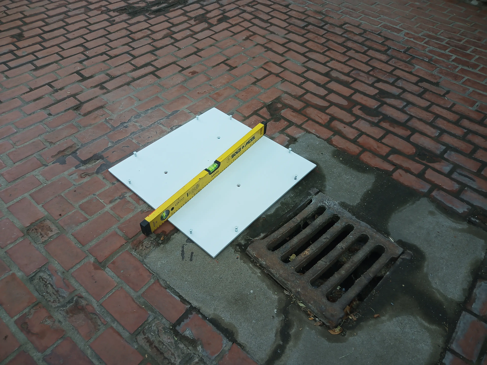
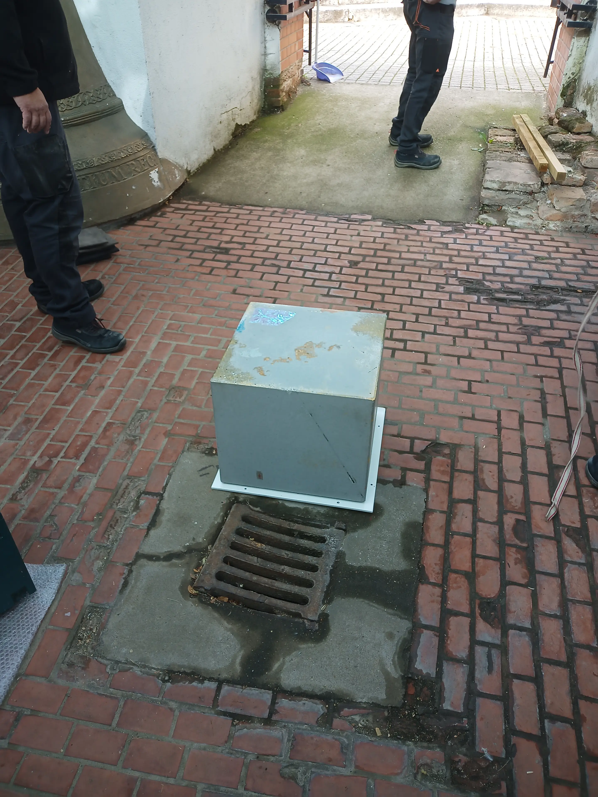
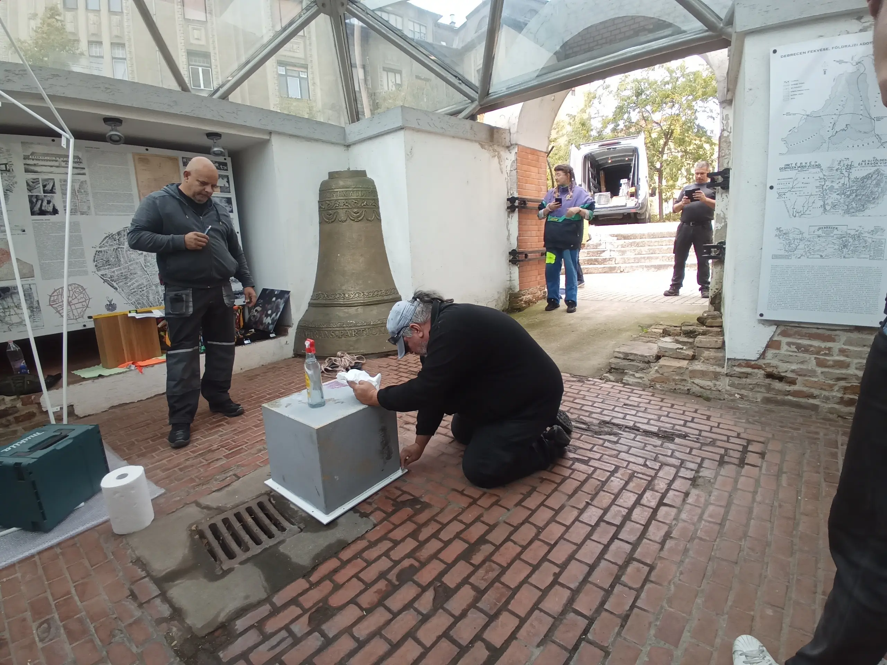
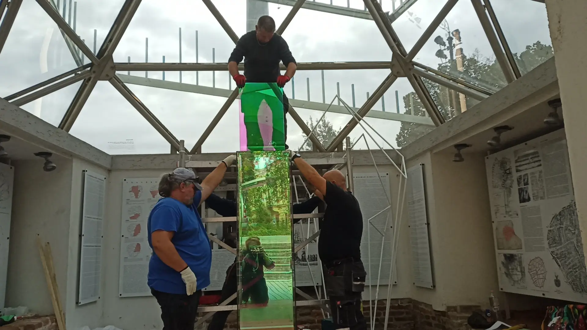
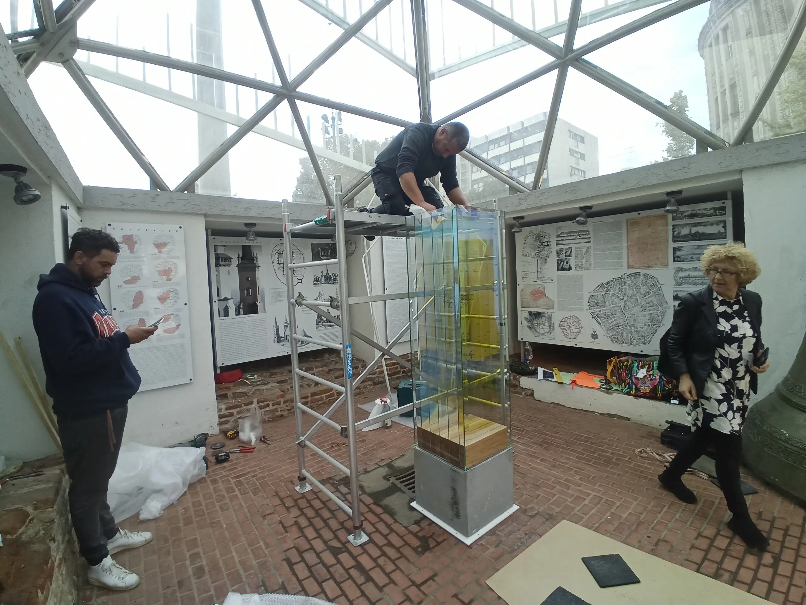
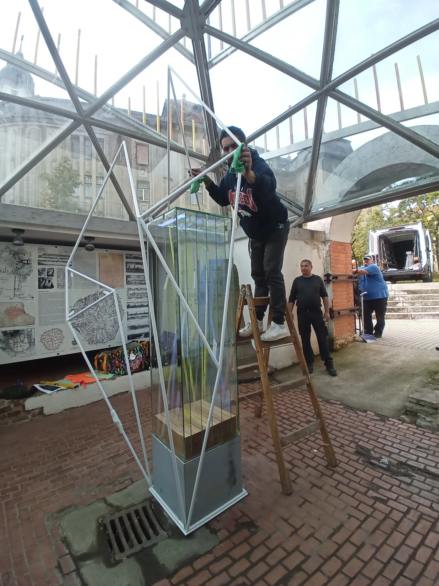
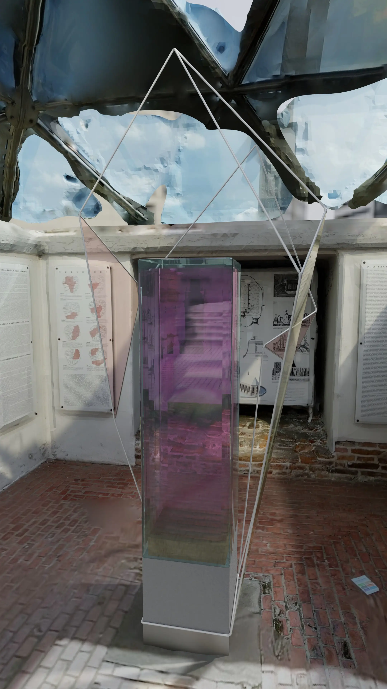
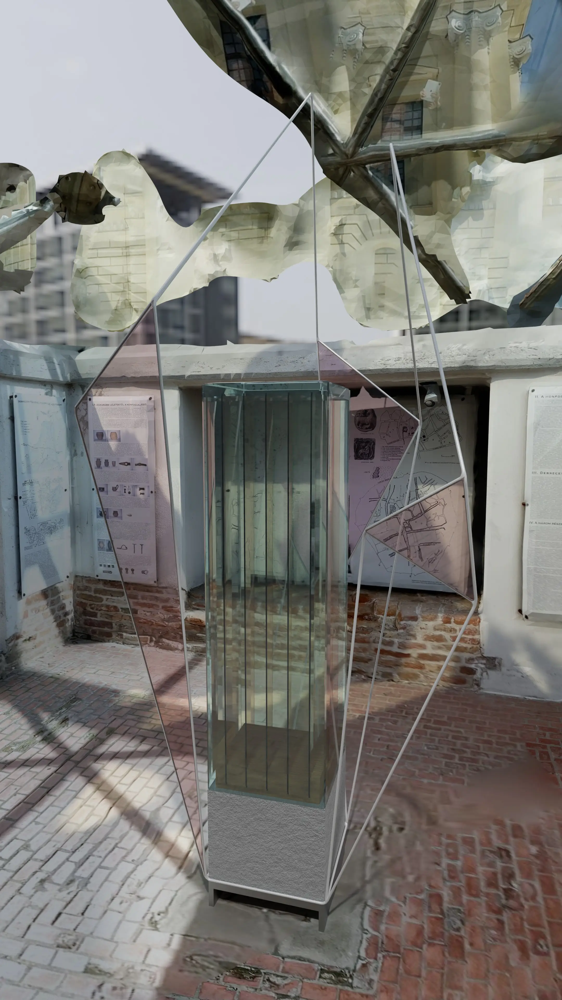
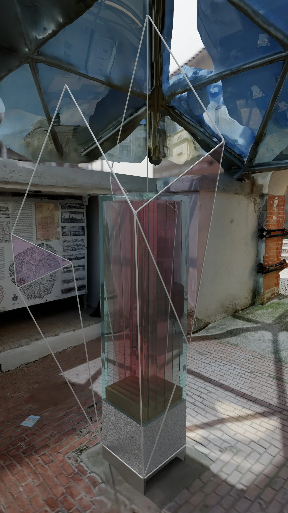

<!-- {
    "img": "design/visual_memory_of_the_fires_of_debrecen/4.webp",
    "title": "Construction of Visual Memory of the Fires of Debrecen",
    "desc": "Construction of a permanent data physicalization sculpture, near Nagytemplom of Debrecen"
} -->

## [Visual Memory of the Fires of Debrecen](/c/design/visual_memory_of_the_fires_of_debrecen)
**Debreceni tűzesetek vizuális emlékezete**

## Buildup

|                                |                     |
| -----------------------------: | :------------------ |
|              **Fanni Hegedűs** | Wood                |
|                **Előd Halász** | Metal               |
|         **Péter István Varga** | Concrete (VPI Kft.) |
|        **János Gyula Szegedi** | Glass               |
| **Piroska Szilágyi Szegediné** | Glass               |

## Previz

|                  |                        |
| ---------------: | :--------------------- |
| **Mihály Minkó** | Photogrammetry         |
| **Dávid Mórász** | 3D model and rendering |

[Go back to main page](/c/design/visual_memory_of_the_fires_of_debrecen)