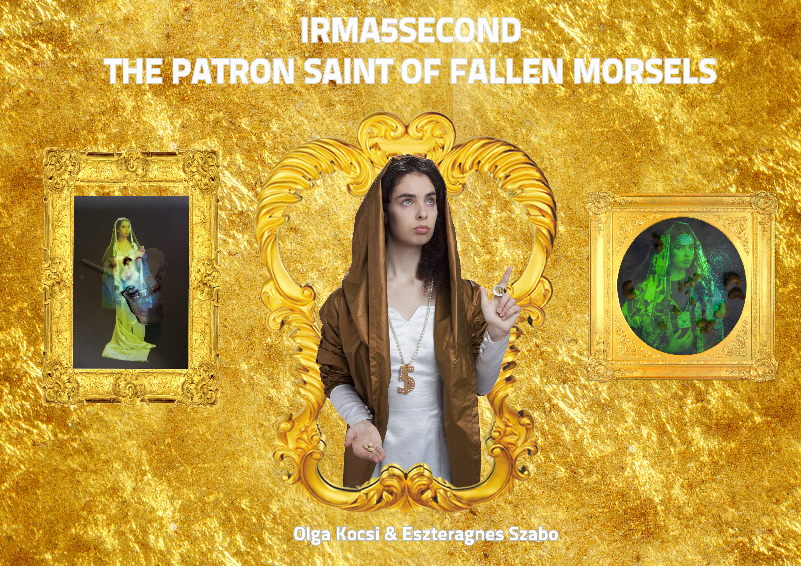

<cardlink href="https://www.godot.hu/kocsiolgaszaboeszteragnes-godot-katalizator-dij-heterotopia">
<a href="https://www.godot.hu/kocsiolgaszaboeszteragnes-godot-katalizator-dij-heterotopia">
</img>

Godot I.C.A.

<h2>Kocsi Olga &amp; Szabó Eszter Ágnes / Godot-Katalizator-díj / Heterotopia /Kiállítás - Godot I.C.A.</h2>

</a>
</cardlink>

<cardlink href="http://www.c3.hu/scripta/lettre/lettre85/00tart.htm">
<a href="http://www.c3.hu/scripta/lettre/lettre85/00tart.htm">

<h2>Lettre, 85. sz�m</h2>

</a>
</cardlink>

<cardlink href="http://www.c3.hu/scripta/lettre/lettre85/arckep.htm">
<a href="http://www.c3.hu/scripta/lettre/lettre85/arckep.htm">

<h2>Lettre, 85. sz�m</h2>

</a>
</cardlink>

<cardlink href="http://nol.hu/lap/tv/20120831-frissen_festve?ref=sso">
<a href="http://nol.hu/lap/tv/20120831-frissen_festve?ref=sso">

<h2>Archívum Előfizetés</h2>

</a>
</cardlink>

<cardlink href="http://web.archive.org/web/20230327071130/http://www.kogart.hu/letoltes/sajto/2012/2012-09-21%20Friss,%20de%20nyugtalan%C3%ADt%C3%B3_%C3%89S.pdf">
<a href="http://web.archive.org/web/20230327071130/http://www.kogart.hu/letoltes/sajto/2012/2012-09-21%20Friss,%20de%20nyugtalan%C3%ADt%C3%B3_%C3%89S.pdf">

<h2>Wayback Machine</h2>

</a>
</cardlink>

<cardlink href="http://web.archive.org/web/20230327070708/http://www.kogart.hu/letoltes/sajto/2012/2012-09-01%20Friss%202012%20_%20T%C3%A1rlat%20+%20Sir%C3%A1lygl%C3%B3ria%20_HVG.pdf">
<a href="http://web.archive.org/web/20230327070708/http://www.kogart.hu/letoltes/sajto/2012/2012-09-01%20Friss%202012%20_%20T%C3%A1rlat%20+%20Sir%C3%A1lygl%C3%B3ria%20_HVG.pdf">

<h2>Wayback Machine</h2>

</a>
</cardlink>
