## Interviews

<iframe width="560" height="315" src="https://www.youtube.com/embed/rU4gO7fzHk0?si=UqFWf3CJB5_pmdhc" title="YouTube video player" frameborder="0" allow="accelerometer; autoplay; clipboard-write; encrypted-media; gyroscope; picture-in-picture; web-share" referrerpolicy="strict-origin-when-cross-origin" allowfullscreen></iframe>
<iframe width="560" height="315" src="https://www.youtube.com/embed/3JmnN8yzf5s?si=Y29sCv6wboLkY2Z2" title="YouTube video player" frameborder="0" allow="accelerometer; clipboard-write; encrypted-media; gyroscope; picture-in-picture; web-share" referrerpolicy="strict-origin-when-cross-origin" allowfullscreen></iframe>
<iframe width="560" height="315" src="https://www.youtube.com/embed/qsRsbPAUqB4?si=NZ_-Q22JNk5nI8PH" title="YouTube video player" frameborder="0" allow="accelerometer; autoplay; clipboard-write; encrypted-media; gyroscope; picture-in-picture; web-share" referrerpolicy="strict-origin-when-cross-origin" allowfullscreen></iframe>
<iframe width="560" height="315" src="https://www.youtube.com/embed/YMAiBmuZTe0?si=UJzXZTsXNMeNNlU0" title="YouTube video player" frameborder="0" allow="accelerometer; autoplay; clipboard-write; encrypted-media; gyroscope; picture-in-picture; web-share" referrerpolicy="strict-origin-when-cross-origin" allowfullscreen></iframe>
<iframe width="560" height="315" src="https://www.youtube.com/embed/6LauZ1mR2sk?si=-dIQYQLoySUHpNkX" title="YouTube video player" frameborder="0" allow="accelerometer; autoplay; clipboard-write; encrypted-media; gyroscope; picture-in-picture; web-share" referrerpolicy="strict-origin-when-cross-origin" allowfullscreen></iframe>

<cardlink href="https://lahmacun.hu/shows/studio-fkse/holy_olga_kiallitasan_jartunk">
<a href="https://lahmacun.hu/shows/studio-fkse/holy_olga_kiallitasan_jartunk">
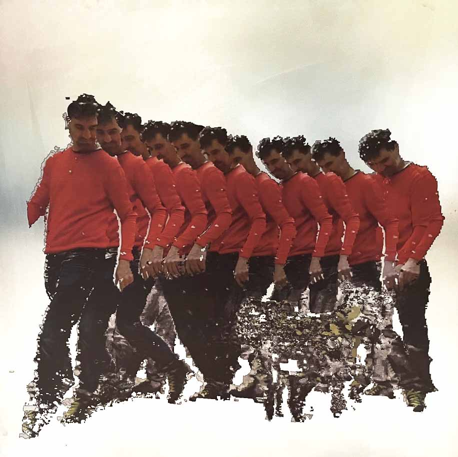</img>

Lahmacun Radio Budapest

<h2>Stúdió FKSE - Holy Olga kiállításán jártunk</h2>

A 2022-es év elején a Budapesti Műszaki és Gazdaságtudományi Egyetem (BME) a műszaki és természettudományos ismereteket nyújtó magyarországi...

</a>
</cardlink>

<cardlink href="https://www.mixcloud.com/MegtervezettVal%C3%B3s%C3%A1g/irma5second-a-leesett-falatok-v%C3%A9d%C5%91szentje/">
<a href="https://www.mixcloud.com/MegtervezettVal%C3%B3s%C3%A1g/irma5second-a-leesett-falatok-v%C3%A9d%C5%91szentje/">

MIXCLOUD

<h2>Irma5second - a leesett falatok védőszentje</h2>

</a>
</cardlink>

<cardlink href="https://www.mixcloud.com/kriptoform/7terito-20190624-aranyba-csomagolt-pop-up-%C3%A9let%C3%A9rz%C3%A9s/">
<a href="https://www.mixcloud.com/kriptoform/7terito-20190624-aranyba-csomagolt-pop-up-%C3%A9let%C3%A9rz%C3%A9s/">

MIXCLOUD

<h2>7terito - 2019.06.24. aranyba csomagolt pop up életérzés</h2>

</a>
</cardlink>

## Press

<cardlink href="https://nepszava.hu/3273176_holy-olga-gloriai">
<a href="https://nepszava.hu/3273176_holy-olga-gloriai">
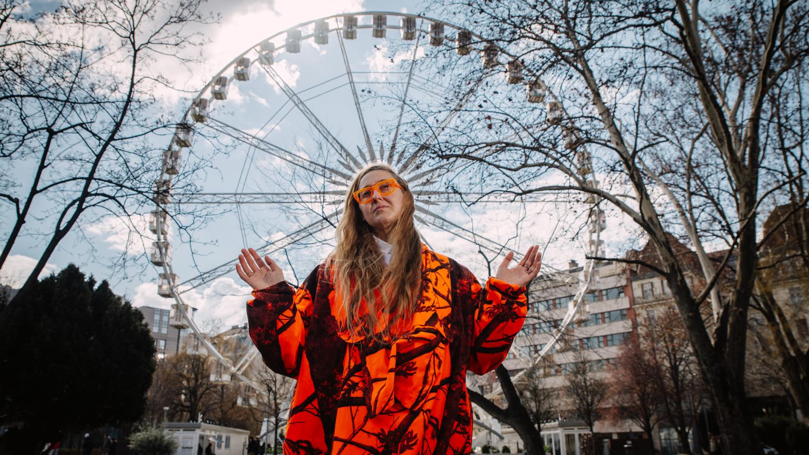</img>

Népszava

<h2>Holy Olga glóriái  </h2>

Kocsi Olga képzőművészt számos társadalmi kérdés foglalkoztatja, például a háztartásban végzett láthatatlan munka értéke, az egyéni beteljesületlen vágyak, míg a Velencei Biennáléra beadott pályázatában az abúzus témáját járta körül. Az évek során alteregót talált ki magának: ő lett Holy Olga, azaz Szent Olga, aki jókedvre deríti az embereket, például azzal, hogy megkérdezi tőlük, mitől lennének boldogok.

</a>
</cardlink>

<cardlink href="https://kepzo.art/holy-olga-eredettortenete-interju-kocsi-olgaval-2022-11-01/">
<a href="https://kepzo.art/holy-olga-eredettortenete-interju-kocsi-olgaval-2022-11-01/">
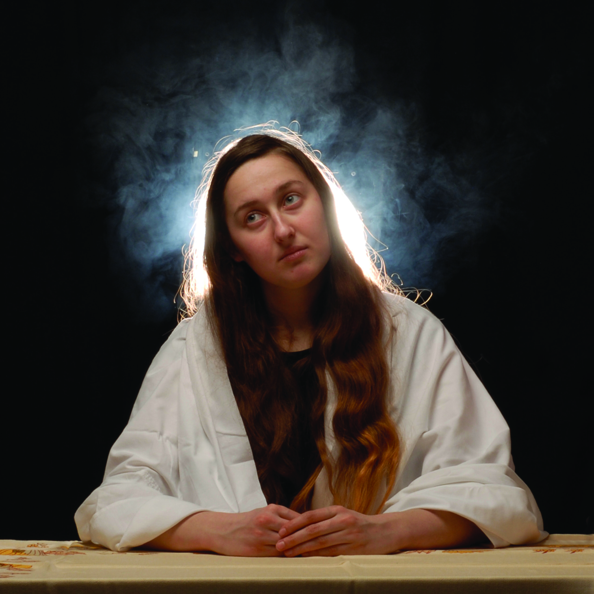</img>

Képző.art

<h2>Holy Olga eredettörténete – Interjú Kocsi Olgával - Képző.art</h2>

Kocsi Olga képzőművésszel beszélgettem szakrális alteregójáról, Holy Olgáról.

</a>
</cardlink>

<cardlink href="https://phmuseum.com/projects/invisible-work-1">
<a href="https://phmuseum.com/projects/invisible-work-1">
</img>

<h2>Invisible work - PhMuseum</h2>

Unseen Labor, Seen: Exploring hidden work (domestic, caregiving) through movement data captured via motion capture technology. From cooking, playing music, to caring for children, everyday actions transformed into digital sculptures, prints, glasses.

</a>
</cardlink>

<cardlink href="https://ujmuveszet.hu/kunszt/gondolat-nelkul-nalam-nincs-munka/">
<a href="https://ujmuveszet.hu/kunszt/gondolat-nelkul-nalam-nincs-munka/">
</img>

ÚjMűvészet

<h2>Gondolat nélkül nálam nincs munka - ÚjMűvészet</h2>

Molnár Judit Lilla &quot;Nagyon sok minden érdekel, több életre való ötlet van a fejemben, végtelen sok minden pörög odabenn. Talán inkább arra nehéz fókuszálni, mikor mivel foglalkozzak, mire szánjak időt. &quot; - Kocsi Olga

</a>
</cardlink>

<cardlink href="https://ujmuveszet.hu/a-felemelkedes-torvenyszerusege/">
<a href="https://ujmuveszet.hu/a-felemelkedes-torvenyszerusege/">
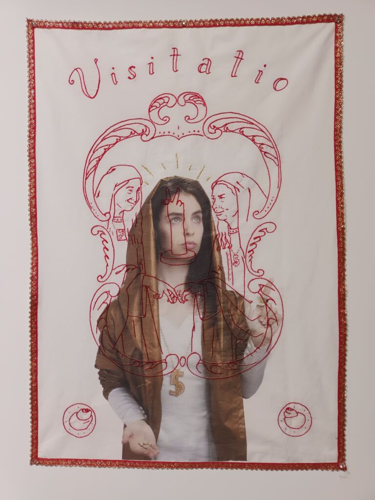</img>

ÚjMűvészet

<h2>A felemelkedés törvényszerűsége - ÚjMűvészet</h2>

Lits Levente A felemelkedés törvényszerűségébe vetett hit hívta életre magát a politikai gazdaságtant. E kapcsán emelném be az Egyház társadalmi tanításának kompendiumában szereplő alábbi gondolatot, hogy az idézet és egy kortárs alkotás vizsgálata során a gazdasági gondolkodás számára is egyértelmű legyen az értékrendi példaképekről úgy gondolkodni mint méltóságunk részeiről, így emberi jogunkról s az emancipációs folyamat szükségszerű eleméről. A szentek, akik Isten országának cselekvő előidézői és a mindenkori világ példaképei, e diskurzushoz szolgálnak alapul.

</a>
</cardlink>

<cardlink href="https://ujmuveszet.hu/kunszt/a-csodas-fordulat-sajnos-elmaradt/">
<a href="https://ujmuveszet.hu/kunszt/a-csodas-fordulat-sajnos-elmaradt/">
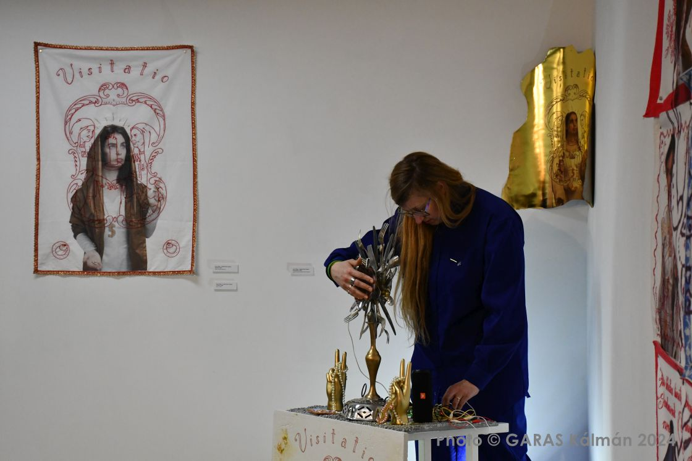</img>

ÚjMűvészet

<h2>A csodás fordulat sajnos elmaradt - ÚjMűvészet</h2>

Jankó Judit Szabó Eszter Ágnes Csoda című kiállítása Szombathelyen nem emlékkiállításnak készült, de mégis búcsú lett belőle, noha a tárlat koncepcióját még maga a művész állította össze, sőt a címadás is hozzá köthető. Diákjai és kortársai fontosnak tartották, hogy ez az utolsó projekt megvalósuljon.

</a>
</cardlink>

<cardlink href="https://www.glamour.hu/plusz/aktualis/kocsi-olga-interju/q94mwzk">
<a href="https://www.glamour.hu/plusz/aktualis/kocsi-olga-interju/q94mwzk">
</img>

GLAMOUR.HU

<h2>Két perc alatt eladni magukat sokszor lehetetlen, pedig az emberek figyelme összement, ennyi idő van rá</h2>

Kocsi Olga multimédia művész, akinek különböző projektjeivel szerte az országban találkozhatunk. A Moholy-Nagy Művészeti Egyetemen végzett, bár sokszor futott neki a felvételinek egész országszerte több helyen. Negyedjére vették fel.

</a>
</cardlink>

<cardlink href="https://eelisa.eu/when-arts-meet-science-at-bmes-art-residency-program/">
<a href="https://eelisa.eu/when-arts-meet-science-at-bmes-art-residency-program/">
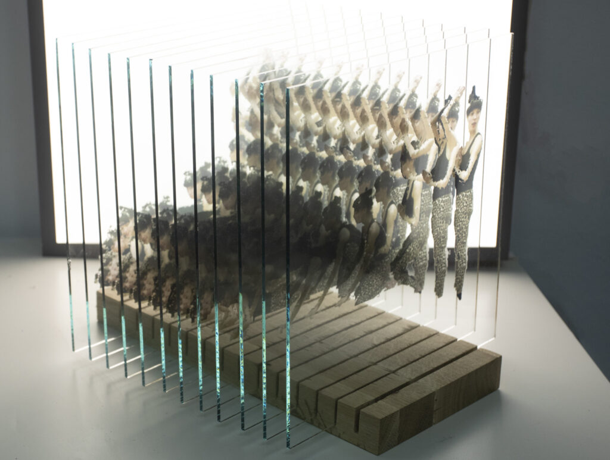</img>

EELISA

<h2>When art meets science: BME&#039;s Art Residency Program &#8212; EELISA</h2>

</a>
</cardlink>

<cardlink href="https://rezidensmuvesz.bme.hu/tag/kocsi-olga/">
<a href="https://rezidensmuvesz.bme.hu/tag/kocsi-olga/">

<h2>Kocsi Olga &#8211; BME Művészeti Rezidenciaprogram</h2>

</a>
</cardlink>

<cardlink href="https://rezidensmuvesz.bme.hu/a-vilag-osszes-penzet-el-lehetne-kolteni-muveszetre-zaro-interju-kocsi-olgaval/">
<a href="https://rezidensmuvesz.bme.hu/a-vilag-osszes-penzet-el-lehetne-kolteni-muveszetre-zaro-interju-kocsi-olgaval/">
</img>

<h2>„A világ összes pénzét el lehetne költeni művészetre” – záró interjú Kocsi Olgával</h2>

Kocsi Olga a rezidenciaprogram egyik nyertes pályázója volt, aki a Műszaki Egyetem tanáraival konzultálva hozta létre a Láthatatlan munka című kiállítást. Olga a kiállításon a különböző hétköznapi…

</a>
</cardlink>

<cardlink href="https://qubit.hu/2023/03/18/holy-olga-a-muvesz-aki-a-tudomany-segitsegevel-tette-lathatova-a-lathatatlan-munkat">
<a href="https://qubit.hu/2023/03/18/holy-olga-a-muvesz-aki-a-tudomany-segitsegevel-tette-lathatova-a-lathatatlan-munkat">
</img>

Qubit

<h2>Holy Olga: a művész, aki a tudomány segítségével tette láthatóvá a láthatatlan munkát</h2>

Magyarországon egyedülálló művészeti rezidenciaprogram eredményét mutatták be a Műegyetem minikiállításán: az alkotók a BME tudósaival együtt dolgoztak egy-egy projekten. De hogyan lehet száraz kutatási adatok alapján műalkotássá formálni a teregetést, a mosogatást vagy a tésztafőzést?

</a>
</cardlink>

<cardlink href="https://www.prae.hu/news/42557-bme-muveszeti-rezidenciaprogram-zarokiallitasa-a-muegyetemen/">
<a href="https://www.prae.hu/news/42557-bme-muveszeti-rezidenciaprogram-zarokiallitasa-a-muegyetemen/">
</img>

PRAE.HU - a művészeti portál

<h2>BME Művészeti Rezidenciaprogram zárókiállítása a Műegyetemen / PRAE.HU - a művészeti portál</h2>

Március 8-án, szerdán este 6 órakor nyílik meg Kocsi Olga és Boruzs Ádám, BME Művészeti Rezidenciaprogram 2022-es évi nyertes művészeinek zárókiállítása a Műegyetemen.

</a>
</cardlink>

<cardlink href="https://mome.hu/en/hirek/varostorteneti-adatokbol-keszult-szoborral-allit-emleket-debrecen-a-helyi-tuzveszeknek">
<a href="https://mome.hu/en/hirek/varostorteneti-adatokbol-keszult-szoborral-allit-emleket-debrecen-a-helyi-tuzveszeknek">
</img>

<h2>MOME | Debrecen commemorates local fires with a sculpture made using urban historical data </h2>

</a>
</cardlink>

<cardlink href="https://kassakmuzeum.hu/hu/kassak-kortars-muveszeti-dij-2025-dontosei">
<a href="https://kassakmuzeum.hu/hu/kassak-kortars-muveszeti-dij-2025-dontosei">
</img>

Kassák

<h2>A KASSÁK KORTÁRS MŰVÉSZETI DÍJ 2025 DÖNTŐSEI</h2>

A Kassák kortárs művészeti díjat idén negyedszer adja át az MNM KK PIM Kassák Múzeum, Dr. Argay István, a díj alapítója, és a Rechnitzer Alapítvány, a díj főtámogatója. 2025-ben a döntőbe Gróf Ferenc és Gyenes Zsófia, Januško Klaudia, Kocsi Olga, Monory Ráhel, Nagy Barbara jutottak be. A döntős pályaművekből idén három a hatalmi struktúrák hatását vizsgálja, egy a jövő tervezésére fókuszál, a kritikai pedagógiát segítségül hívva, egy pedig a látással és a láthatósággal foglalkozik.

</a>
</cardlink>

<cardlink href="https://librarius.hu/2022/04/17/a-bme-elso-rezidens-muveszei-boruzs-adam-es-kocsi-olga/">
<a href="https://librarius.hu/2022/04/17/a-bme-elso-rezidens-muveszei-boruzs-adam-es-kocsi-olga/">
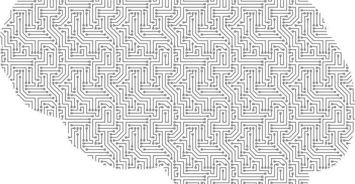</img>

Librarius.hu

<h2>A BME első rezidens művészei: Boruzs Ádám és Kocsi Olga - Librarius.hu</h2>

A 80 beérkezett pályázatból a zsűri Boruzs Ádámét és Kocsi Olgáét választotta, ők dolgoznak tíz hónapon át a BME kutatóival és hallgatóival

</a>
</cardlink>

<cardlink href="https://kultura.hu/kocsi-olga-nyerte-el-a-hab-dijat/">
<a href="https://kultura.hu/kocsi-olga-nyerte-el-a-hab-dijat/">
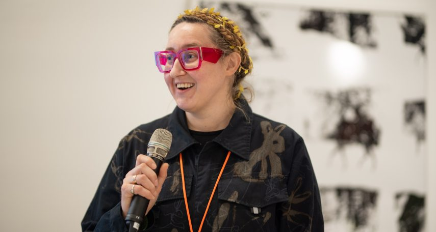</img>

<h2>Kocsi Olga nyerte el a HAB-díjat</h2>

Ünnepélyes díjátadón hirdette ki a HAB-díj nyertesét a Hungarian Art &amp; Business művészeti központot működtető MBH Bank Művészeti Alapítvány. A díjat a tavalyi évben alapították azzal a céllal, hogy egy kiválasztott, 35 év feletti művész számára az Alapítvány alkotói támogatást nyújtson összesen nettó 3,2 millió forint értékben. A benyújtott pályázatok közül Kocsi Olga 7x7 Beton ikon című alkotásának ítélte oda a szakmai zsűri az első helyezést, amelynek értelmében a mű megvalósítását követően az alkotás az alapítványi műgyűjtemény része lesz.

</a>
</cardlink>

<cardlink href="https://woohoo.hu/kihirdette-a-hab-dij-nyerteset-az-mbh-bank-muveszeti-alapitvany/">
<a href="https://woohoo.hu/kihirdette-a-hab-dij-nyerteset-az-mbh-bank-muveszeti-alapitvany/">
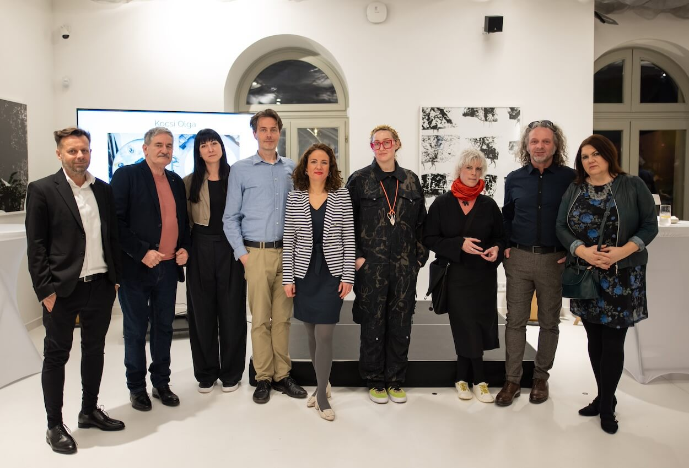</img>

woohoo.hu

<h2>Kihirdette a HAB Díj nyertesét az MBH Bank Művészeti Alapítvány</h2>

Ünnepélyes díjátadón hirdette ki a HAB Díj nyertesét a Hungarian Art &amp; Business művészeti központot működtető MBH Bank Művészeti Alapítvány.

</a>
</cardlink>

<cardlink href="https://magyarnemzet.hu/kultura/2024/03/hab-dij-2024">
<a href="https://magyarnemzet.hu/kultura/2024/03/hab-dij-2024">
</img>

Magyar Nemzet

<h2>Polgári napilap és hírportál | Magyar Nemzet</h2>

Magyar Nemzet - Szellemi honvédelem 1938 óta. Friss hírek hazai, külföldi, sport, kultúra és gazdasági témakörökben. Véleménycikkek és történelmi visszatekintések.

</a>
</cardlink>

<cardlink href="https://magyarnarancs.hu/kepzomuveszet/szlalomozhat-a-ragyogasban-244396">
<a href="https://magyarnarancs.hu/kepzomuveszet/szlalomozhat-a-ragyogasban-244396">
</img>

Magyarnarancs.hu

<h2>Volt J&eacute;zus, villanyszerelő &eacute;s karossz&eacute;rialakatos</h2>

A Holy Olga &eacute;s Piros Kocsi neveken is alkot&oacute; műv&eacute;sz saj&aacute;t mag&aacute;t avatta szentt&eacute;. T&ouml;bb &eacute;rz&eacute;kre hat&oacute; multimedi&aacute;lis install&aacute;ci&oacute;i a hat&aacute;rokat feszegetik.

</a>
</cardlink>

<cardlink href="https://ligetgallery.art/exhibition_item/model-family/">
<a href="https://ligetgallery.art/exhibition_item/model-family/">

<h2>Ida Csapó &#038; Olga KocsiModel Family &#8211; Liget Gallery</h2>

</a>
</cardlink>

<cardlink href="https://blog.capacenter.hu/2021/10/17/mate-wagner-show-us-what-you-eat-and-well-capture-who-you-are-capazine-lets-eat/">
<a href="https://blog.capacenter.hu/2021/10/17/mate-wagner-show-us-what-you-eat-and-well-capture-who-you-are-capazine-lets-eat/">
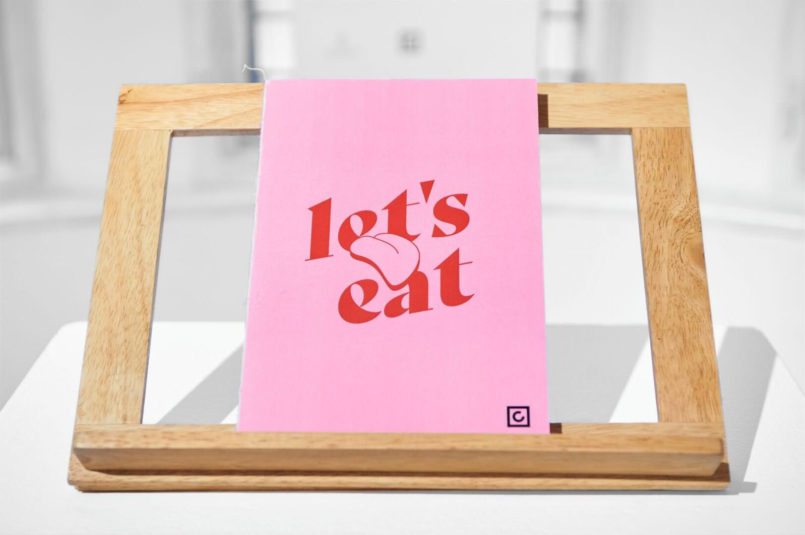</img>

CAPA BLOG | A Capa Központ blogja

<h2>Máté Wágner: Show us What You Eat and We&#039;ll Capture Who You Are (CAPAZINE – LET&#039;S EAT) - CAPA BLOG | A Capa Központ blogja</h2>

&quot;The artworks produced at the CAPAZINE – LET’S EAT workshop prove that the visual representation of food is such an extremely complex cultural phenomenon as food itself.&quot;—Máté Wágner participated on the CAPAZINE – LET’S EAT workshop as a writer. His essay called Show us What You Eat and We&#039;ll Capture Who You Are she reflects on the works made during the workshop.

</a>
</cardlink>

<cardlink href="https://designisso.com/2021/10/07/muti-mit-eszel-erzeki-kepek-a-lets-eat-fotokiallitasrol/">
<a href="https://designisso.com/2021/10/07/muti-mit-eszel-erzeki-kepek-a-lets-eat-fotokiallitasrol/">
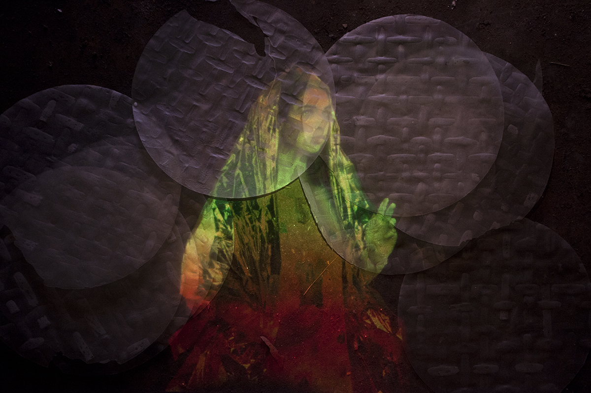</img>

DESIGNISSO - magazine for design and visual arts

<h2>Muti, mit eszel! – Érzéki képek a Let’s eat fotókiállításról - DESIGNISSO</h2>

Látni és érzékelni – ez a két fogalom sokáig szemben állt egymással. Míg a látást az objektív megismerés elsődleges eszközének tekintjük, addig az érzékelés alatt valami szubjektív, személyes, nem racionalizálható benyomást szoktunk érteni. Annak ellenére, hogy mára ez az elgondolás veszített kizárólagosságából, részben talán feloldódott, a fotóművészet mégis nehezen szabadul a látás korlátozó kereteiből. A látás kiemelt szerepének – Arisztotelész óta velünk lévő – dogmája lebontható és lebontandó. Többek között erre törekszik a Capa Központ

</a>
</cardlink>

<cardlink href="https://hu.tranzit.org/en/project/0/2015-09-17/creativity-exercises-spaces-of-emancipatory-pedagogies/">
<a href="https://hu.tranzit.org/en/project/0/2015-09-17/creativity-exercises-spaces-of-emancipatory-pedagogies/">

hu.tranzit.org/

<h2>Creativity Exercises – Spaces of Emancipatory Pedagogies</h2>

</a>
</cardlink>

<cardlink href="https://www.godot.hu/kocsiolgaszaboeszteragnes-godot-katalizator-dij-heterotopia">
<a href="https://www.godot.hu/kocsiolgaszaboeszteragnes-godot-katalizator-dij-heterotopia">
</img>

Godot I.C.A.

<h2>Kocsi Olga &amp; Szabó Eszter Ágnes / Godot-Katalizator-díj / Heterotopia /Kiállítás - Godot I.C.A.</h2>

</a>
</cardlink>

<cardlink href="https://hvg.hu/360/20240226_a_mu_kiallitas_kepzomuveszet_csapo_ida_kocsi_olga_liget_galeria">
<a href="https://hvg.hu/360/20240226_a_mu_kiallitas_kepzomuveszet_csapo_ida_kocsi_olga_liget_galeria">
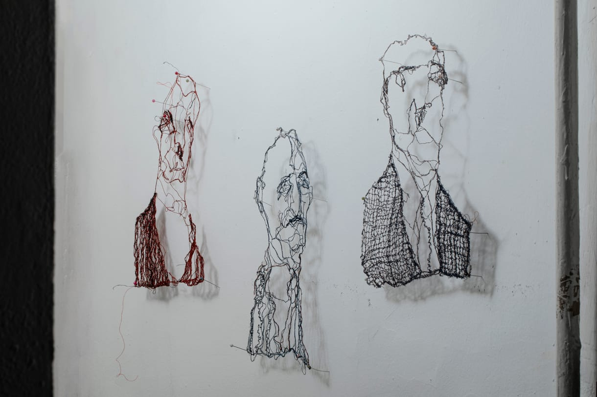</img>

hvg.hu

<h2>Óvatlanul kimondott szavak, elrejtett vallomások – családi traumák és titkok Csapó Ida és Kocsi Olga kiállításán</h2>

Két olyan alkotó, Csapó Ida (1952) és Kocsi Olga (1987), közös kiállítása látható a megújult Liget Galériában, akik amellett, hogy vizuális műveket hoznak létre, a következő szakmákban is szakképesítéssel és/vagy szaktudással rendelkeznek: újságíró, gép-és gyorsíró, női önismereti tréner, varrónő, villanyszerelő, karosszérialakatos, oktató. A kiállítás persze nem emiatt izgalmas, de talán jelzi, hogy némileg szokatlan az, ami a látogatóra vár.

</a>
</cardlink>

<cardlink href="https://www.artmagazin.hu/articles/ajanljuk_eztnezd/sator_labirintus_szuvenir">
<a href="https://www.artmagazin.hu/articles/ajanljuk_eztnezd/sator_labirintus_szuvenir">
</img>

Artmagazin

<h2>Ezt nézd – A sátor, a labirintus, és a szuvenír</h2>

</a>
</cardlink>

<cardlink href="https://www.kisalfold.hu/helyi-kultura/2023/04/alkotok-az-apatsag-ihleteseben-otodik-eve-nyitja-kortas-muvesztarlatat-pannonhalma-fotok">
<a href="https://www.kisalfold.hu/helyi-kultura/2023/04/alkotok-az-apatsag-ihleteseben-otodik-eve-nyitja-kortas-muvesztarlatat-pannonhalma-fotok">

<h2>Alkotók az apátság ihletésében - Hatodik éve nyitja kortás művésztárlatát Pannonhalma - fotók</h2>

</a>
</cardlink>

<cardlink href="https://www.magyarkurir.hu/hirek/zarandoklat-kortars-muveszeti-kiallitas-nyilt-pannonhalmi-foapatsagban">
<a href="https://www.magyarkurir.hu/hirek/zarandoklat-kortars-muveszeti-kiallitas-nyilt-pannonhalmi-foapatsagban">
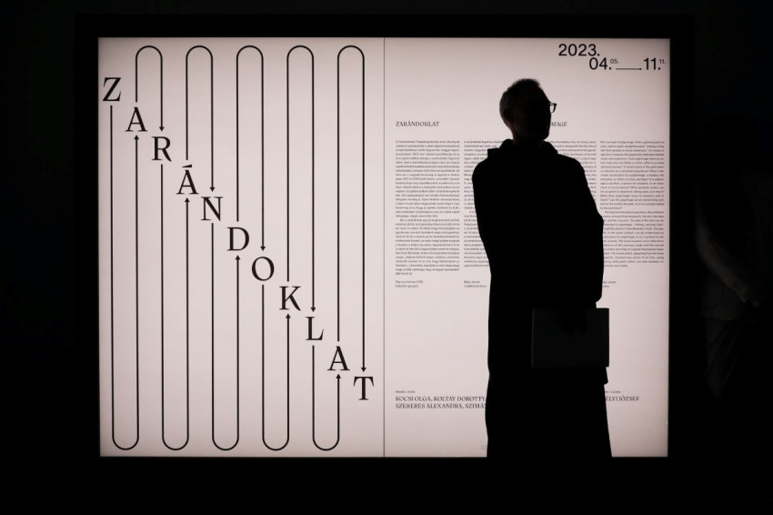</img>

Magyar Kurír

<h2>Zarándoklat – Kortárs művészeti kiállítás nyílt a Pannonhalmi Főapátságban</h2>

Április 5-én, nagyszerdán nyílt meg a Pannonhalmi Főapátság kortárs művészeti kiállítása. A főapátság idei kulturális-spirituális évadának témája a zarándoklat – 2023-ban e fogalom körbejárására és megértésére tesznek kísérletet művészek, alkotók, szerzetesek és az érdeklődő vendégek. A tárlat november 11-ig ingyenesen megtekinthető a főmonostori kiállítótérben.

</a>
</cardlink>

<cardlink href="https://www.donumenta.de/en/world-heritage-revisited/air-artist-in-residence-program/olga-kocsi-intermediate-tones/">
<a href="https://www.donumenta.de/en/world-heritage-revisited/air-artist-in-residence-program/olga-kocsi-intermediate-tones/">

donumenta

<h2>Olga Kocsi - Intermediate Tones</h2>

</a>
</cardlink>

<cardlink href="https://archive.lifelongburning.eu/projects/events/e/residency-nora-barna-and-kocsi-olga-piroska.html">
<a href="https://archive.lifelongburning.eu/projects/events/e/residency-nora-barna-and-kocsi-olga-piroska.html">

<h2>Events</h2>

</a>
</cardlink>

<cardlink href="https://blog.capacenter.hu/2019/10/21/the-futures-talents-of-capa-center-in-2019-olga-kocsi/">
<a href="https://blog.capacenter.hu/2019/10/21/the-futures-talents-of-capa-center-in-2019-olga-kocsi/">
</img>

CAPA BLOG | A Capa Központ blogja

<h2>The Futures talents of Capa Center in 2019: Olga Kocsi - CAPA BLOG | A Capa Központ blogja</h2>

&quot;For me, the role of the medium varies from project to project. Sometimes I use it to document things, other times I work with the process itself. I use the apparatus as a time-absorbing tool, for creating impressions.&quot; – Get to know Olga Kocsi, one of the Futures talent of Capa Center in 2019.

</a>
</cardlink>

<cardlink href="http://issuu.com/elnfree/docs/balkon_2013_07_08/45">
<a href="http://issuu.com/elnfree/docs/balkon_2013_07_08/45">
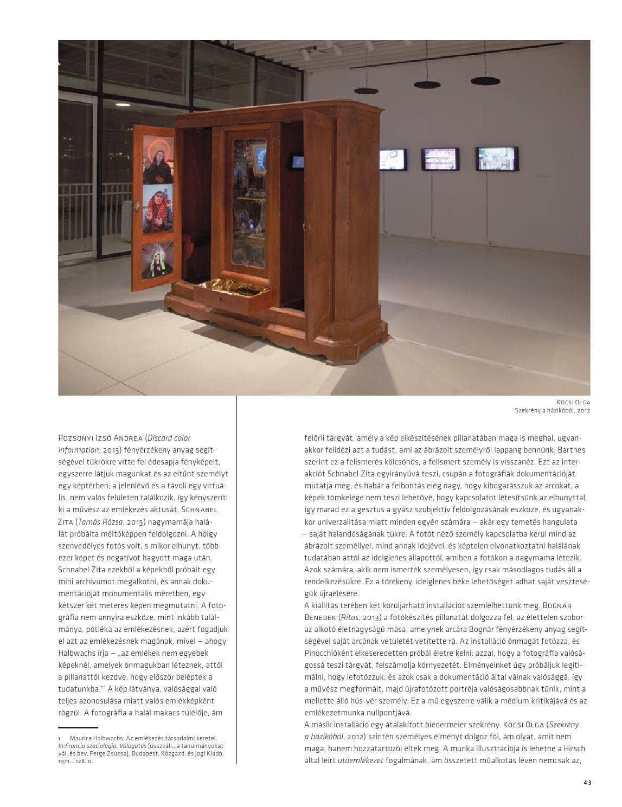</img>

Issuu

<h2>Balkon 2013_7_8</h2>

Contemporary Art Magazine, Budapest

</a>
</cardlink>

<cardlink href="http://phenomenon.hu/a-het-kreativja-kocsi-olga/">
<a href="http://phenomenon.hu/a-het-kreativja-kocsi-olga/">

PHENOM, www.phenom.hu

<h2>A hét kreatívja: Kocsi Olga | phenom.hu</h2>

Kocsi Olga &eacute;s szakr&aacute;lis altereg&oacute;ja, a Holy Olga műv&eacute;szeti alkot&aacute;s ak&aacute;r Magyarorsz&aacute;g tiszteletbeli v&...

</a>
</cardlink>

<cardlink href="http://centrifuga.blog.hu/2013/05/16/szent_olga_es_a_nyul_az_essl_award_magyar_jeloltjei_1_kocsi_olga">
<a href="http://centrifuga.blog.hu/2013/05/16/szent_olga_es_a_nyul_az_essl_award_magyar_jeloltjei_1_kocsi_olga">
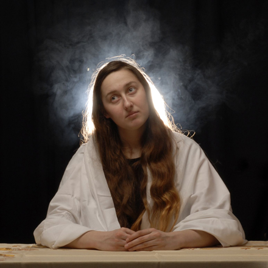</img>

IrodalmiCentrifugA

<h2>Szent Olga és a nyúl - Az Essl Award magyar jelöltjei 1.: Kocsi Olga</h2>

A privát és a nyilvános terek érdeklik, keresi a helyét, s izgatja a transzcendens - magát éppúgy képes szentként, mint nyúlként láttatni; eljátszik a reklámokkal, s mélyen a családtörténetben gyökerező munkáival a családhoz és nőkhöz köthető helyszínek és történetek&hellip;

</a>
</cardlink>

<cardlink href="http://www.c3.hu/scripta/lettre/lettre85/00tart.htm">
<a href="http://www.c3.hu/scripta/lettre/lettre85/00tart.htm">

<h2>Lettre, 85. sz�m</h2>

</a>
</cardlink>

<cardlink href="http://www.c3.hu/scripta/lettre/lettre85/arckep.htm">
<a href="http://www.c3.hu/scripta/lettre/lettre85/arckep.htm">

<h2>Lettre, 85. sz�m</h2>

</a>
</cardlink>

<cardlink href="http://web.archive.org/web/20210117125917/http://hg.hu/cikkek/alkotok/15331-holy-olga-ozekrol-nyulakrol-es-ures-papirlapokrol">
<a href="http://web.archive.org/web/20210117125917/http://hg.hu/cikkek/alkotok/15331-holy-olga-ozekrol-nyulakrol-es-ures-papirlapokrol">

HG.HU - Design meets Life

<h2>Holy Olga őzekről, nyulakról és üres papírlapokról</h2>

A Flash Art és a hg.hu Kocsi Olga műtermében

</a>
</cardlink>

<cardlink href="http://web.archive.org/web/20130726041338/http://www.a38.hu/hu/cikk/a-megmaradas-torvenye">
<a href="http://web.archive.org/web/20130726041338/http://www.a38.hu/hu/cikk/a-megmaradas-torvenye">

<h2>A38 Hajó - A38 Kiállítóhely - A megmaradás törvénye</h2>

Megnyílt a Moholy-Nagy Művészeti Egyetem aktív és a közelmúltban végzett hallgatóinak a gyász tematikáját feldolgozó tárlata az A38 kiállítóterében, amely április 2-áig tekinthető meg. Alant közöljük Borbély Szilárd költő kiváló és megrázó megnyitószövegét. 

</a>
</cardlink>

<cardlink href="http://www.zetapress.hu/kultura/kiallitas/37124">
<a href="http://www.zetapress.hu/kultura/kiallitas/37124">

<h2>  Friss 2012 a KogArtban | ZETApress</h2>

</a>
</cardlink>

<cardlink href="https://epa.oszk.hu/00000/00012/00069/arckep.htm">
<a href="https://epa.oszk.hu/00000/00012/00069/arckep.htm">

<h2>Lettre, 85. sz�m</h2>

</a>
</cardlink>

<cardlink href="http://www.dailymotion.com/video/xx348f_uj-tagok-02-in-fkse-2013_creation#.UZdHALtxkUU">
<a href="http://www.dailymotion.com/video/xx348f_uj-tagok-02-in-fkse-2013_creation#.UZdHALtxkUU">
</img>

Dailymotion

<h2>Új tagok (02) in FKSE 2013 - video Dailymotion</h2>

Watch Új tagok (02) in FKSE 2013 - inexhibition on Dailymotion

</a>
</cardlink>

<cardlink href="http://web.archive.org/web/20230327071130/http://www.kogart.hu/letoltes/sajto/2012/2012-09-21%20Friss,%20de%20nyugtalan%C3%ADt%C3%B3_%C3%89S.pdf">
<a href="http://web.archive.org/web/20230327071130/http://www.kogart.hu/letoltes/sajto/2012/2012-09-21%20Friss,%20de%20nyugtalan%C3%ADt%C3%B3_%C3%89S.pdf">

<h2>Wayback Machine</h2>

</a>
</cardlink>

<cardlink href="http://web.archive.org/web/20230327070708/http://www.kogart.hu/letoltes/sajto/2012/2012-09-01%20Friss%202012%20_%20T%C3%A1rlat%20+%20Sir%C3%A1lygl%C3%B3ria%20_HVG.pdf">
<a href="http://web.archive.org/web/20230327070708/http://www.kogart.hu/letoltes/sajto/2012/2012-09-01%20Friss%202012%20_%20T%C3%A1rlat%20+%20Sir%C3%A1lygl%C3%B3ria%20_HVG.pdf">

<h2>Wayback Machine</h2>

</a>
</cardlink>
