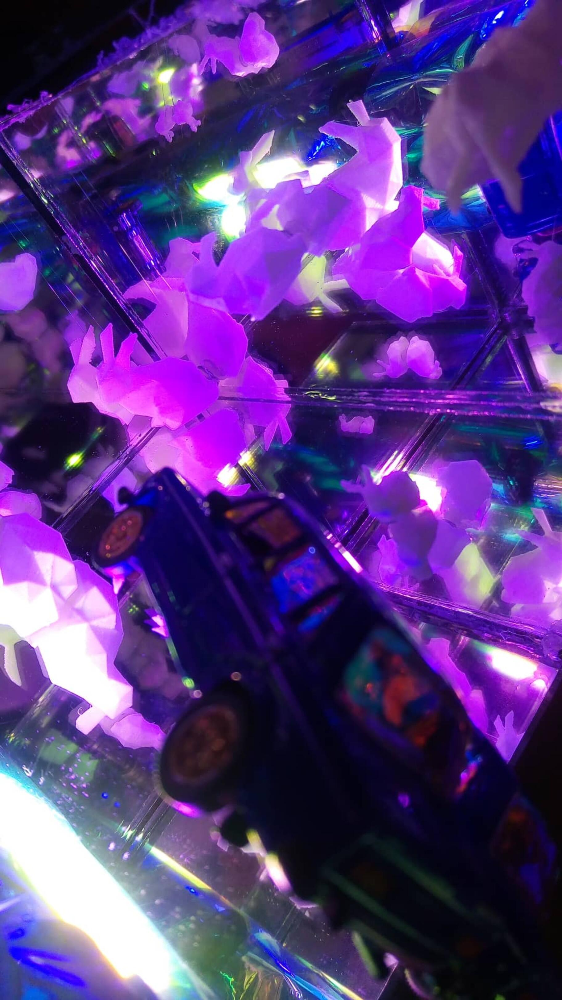
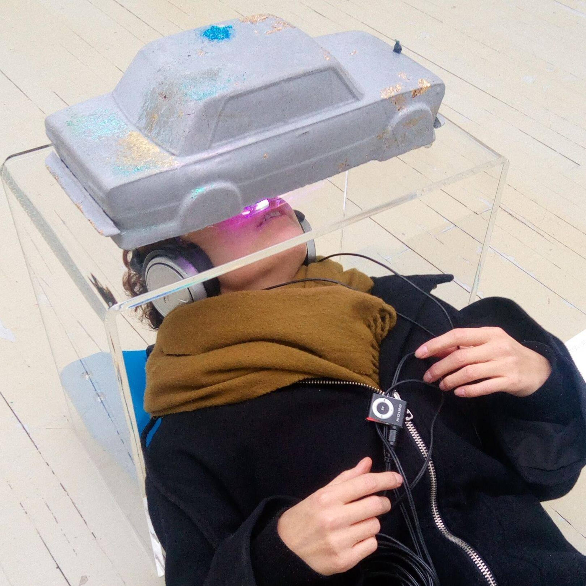
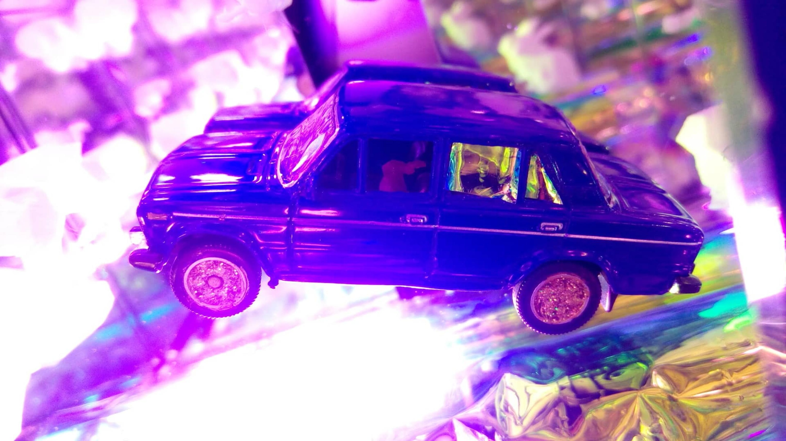
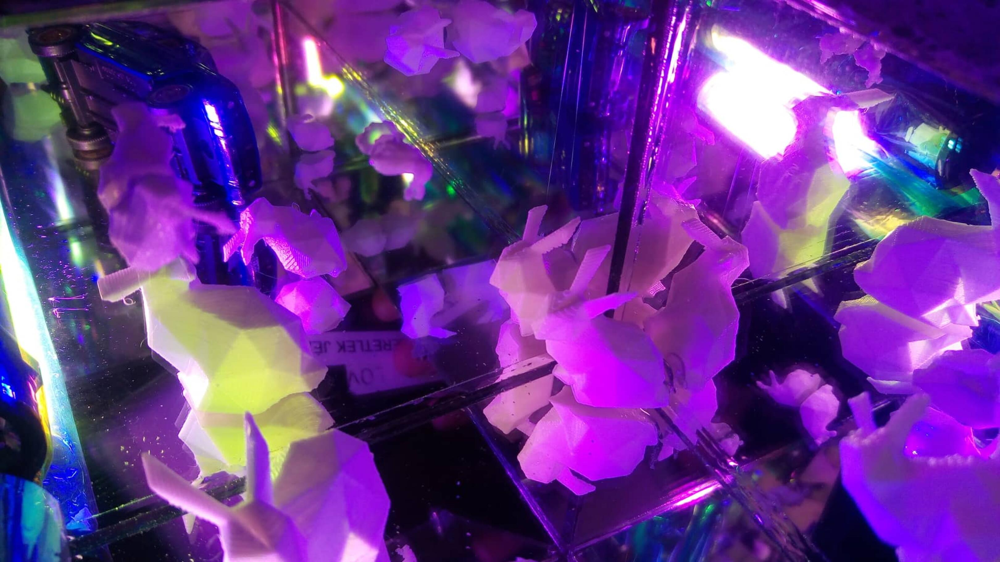

<!-- {
    "img": "Beton-Lada_2017/2.jpg",
    "title": "Beton Lada (2019)",
    "desc": "Miniaturized concrete LADA universe"
} -->

# Beton LADA
**DERKO 2019**, Műcsarnok, Budapest, Hungary  
**Leopold Bloom 2022**, Q contemporary, Budapest, Hungary

The LADA, in which I grew up, got shrank down, changed its material and expanded inside. It moves from digital to analog. BETON LADA and [VR LADA](/c/projects/vr_lada-2017) are connected to each other in the space of sound. The inspiration was Kusama’s endless mirror spaces. I wanted to create the rabbit universe in reality. I wish to create my own world. I was interested in the inner space and outer space. Positioning and the situation of the viewer are very interesting to me. The inner world of BETON LADA comes to light when we interact with the action, immerse ourselves in the space, and get a completely different perspective. Covering the senses, image, sound and body work at the same time, a multi-sensory experience. For me, the rabbit universe is a world of wonder as I see the LADA and in which I invite the viewer.

size 60x50x30cm  
mixed media. sculpter + sound

## [Back to projects](/c/projects)
