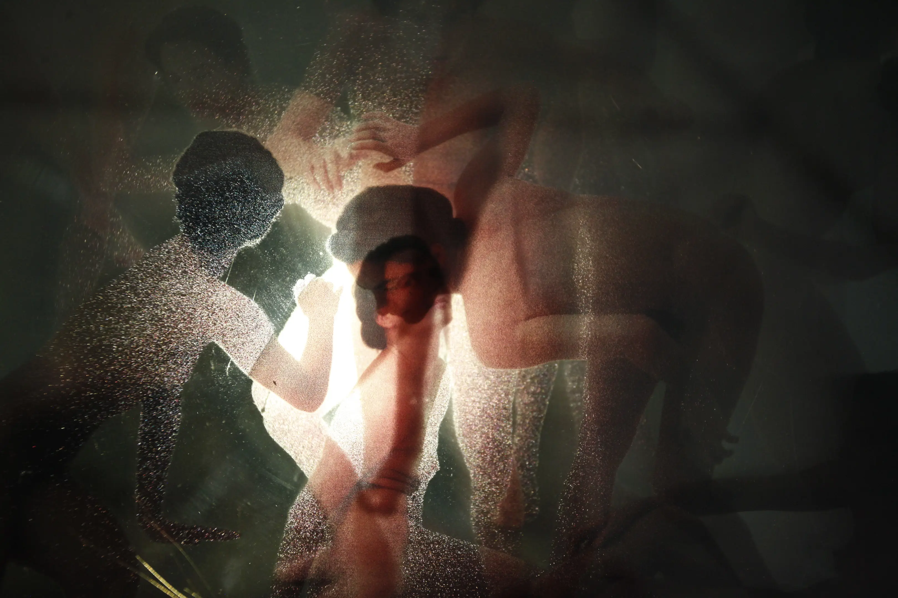
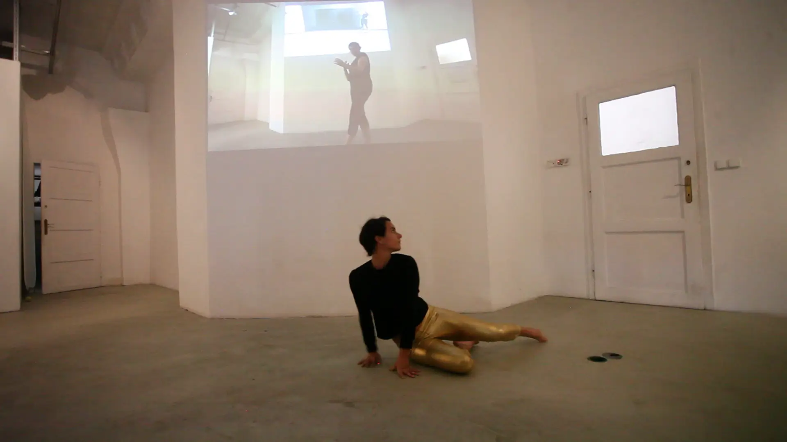

<!-- {
    "img": "zoltai-2022/zoltai02.jpg",
    "title": "The Patron Saint of Fallen morsels (2021)",
    "desc": "Collaboration with Eszter Ágnes Szabó"
} -->

# Imprint of Time
2009-2019

> Michelangelo's Battle of Cascina is the  sketch for a never-completed large-scale fresco. The artist was not interested in showing the fight between Florence and Pisa, but rather in studying human flesh and body. The surge of muscular, dramatically twisted heroic men, as well as their elaborate movements and gestures inspired Olga Kocsi to examine and further interpret the composition of the Renaissance master.  
&nbsp;  
The image unfolds from shape to shape, through which Michelanelo succeeds in placing the emphasis on mapping movement and a variety of poses, completely ignoring the original theme. He sees the mural sketch as a single, clockwise circular movement, a quasi-dance. As if it were just capturing snapshots of a figure and the phases of its movement.  
&nbsp;  
Since Merce Cunnigham, and with the advent of postmodern dance, we can more strongly consider any movement of the body as dance. Dance is no longer the privilege of professional performing artists, it no longer requires classical training or other qualifications. This is emphasised in the two videos in which the artist herself dances Michelangelo's poses. The first video captures the movements and body of the twenty-two-year-old woman, and the second those of the now thirty-two-year-old woman. She reflects on her younger self, and puts her past and present self side by side. A source of inspiration in the creation of the second video was Yvonne Rainer's iconic 1965 work entitled Trio A. Presented in many versions and interpretations, the common and most important feature of these works was that they were created by rethinking previous works.  
&nbsp;  
Using the tools of photography, the gesture is abstracted in four steps. Moment to moment, it records time, body and space. It moves the still images captured by the photograph, illustrating the entire choreography within one image. The temporal dimension in the video is captured in its own reality, condensed into the photographs, forming an imprint. Gradually washed into one, the composition is summed up in a single coherent and unbreakable set.  
&nbsp;  
Powerful masculinity is replaced by the female body. In Kocsi's interpretation, the traditionally masculine game of battle is fought by women. Femininity demands and is awarded space. Kocsi does not proclaim to make feminist art, nevertheless the female voice is increasingly intensified. Born from an inward urge, she draws on her relationship with herself with unquestionable naturalness, in order to experience femininity.  
&nbsp;  
The installation is a good example of varied and experimental use of material, characteristic of Kocsi's work. Stacked on top of each other, the photos on the glass create spatial depth and an interesting playful transition, offering different perspectives to the audience. The exhibittion presents the current status of the ongoing project, which began 10 years ago.

Abigél Végh

## Concept

From change in light to the influence of the environment, all processes in space leave a mark. We consider photography as a medium for snapshots. With cameras we can cut out slices of time from reality and preserve it on a photosensitive surface. When we step out of the "proper use" of photography as a means of recording or capturing, and look at it as a receptive surface, that's where the really exciting things begin for me. If we perceive the light-sensitive surface as time-sensitive too, we are faced with the fact that not only our environment, but time is also captured.

With a long exposure, it's not only the environment that leaves a mark on the image, but time as well. In a series of movements, a person walking in front of a camera not only changes position, but travels in time and space. If the camera is exposing during this process, this phenomenon can be recorded. If you flash during exposure, a sharp gesture will remain. Or, with the aid of a stroboscope, the whole movement can be presented as a sequence. The result is like a sequence cut from a video, compressed into a single image. This technique allows you to examine photography from a completely different angle.

When space and time are separated, we can talk about multiple exposure. Multiple exposure removes space and time from a photosensitive surface. When I do not execute a series of motions sequentially in front of a mounted camera, but instead capture myself with multiple flashes in several stationery positions, we can talk about multiple dimensions and space-time leaps in the context of photography. On such a photo we appear in multiple locations at the same time. Because the photo is still, it captures the event as a timeless medium. However, we can also conceive of this photograph as a time-enclosing unit. The exposure took place in a time interval in which I was in several places.

Continuing this line of thought leads us to question the different ways in which a simple movement can be captured. Take, for example, a simple stroll in the dark, taken with a row of light bulbs wrapped around us. It soon becomes apparent how different the imprint of the movement is to the movement we experience. 

The movement in front of the lens - which we see as a human movement - is displayed by the camera as an interesting abstract stripe, when using a long exposure. Because of the continuous movement, the light itself does not appear as a dot, but rather shows the walk as a moving composition.

During the shots, when the camera is adjusted to be out of focus, the light of the bulbs turn into regular circles. With this technique, the movement of shape has almost migrated from the analogue to the digital world. The well-known use of motion-capture in animation reproduces human motion using balls, which are observed by the computer as animators drag their movements onto the puppets.

In this setting, the same footage as the one you took before appears quite different. Thin, firm lines appear as blurry, soft waves.

The photograph documents the action and the space in which the action took place, in a single cube as a time capsule. The photograph begins to exist as a still video. For such recordings, time is assumed. The same cannot really be said for paintings anymore. I have chosen a Michelangelo image to help me explore this topic. The fresco sketch of the Battle of Cascina shows twenty figures. A multitude of naked male bodies proliferate in the picture.

The similarity of the figures on the image and its monochrome nature made it easier for me to imagine the creation of this work using a single figure, coupled with time and space. The movement of the men floated in front of me like a dance. Dancing a composition, recreating its movements, bringing it to life, promised to be an exciting task. The creation of the image closely involved the use of the processes mentioned.

I printed a digitally assembled photograph onto layers of glass. The figures present the composition through twenty layers of glass stacked on top of each other, in the order of the movement. Twenty sheets of glass measuring 3mm per layer turns into a 6 cm deep object.

I performed and recorded a choreography based on the painting in a studio for a total of 177 seconds. In the picture, my figure appears as a ghost in the composition of the painting. The camera captured the entire process of me retracing the path of the figures in the composition. The condensation of temporality is recorded.

In the studio, I also used flash to re-enact the painting, and during the choreography I flashed at the appropriate points so that my figure would remain a slice in space along with other slices of time.

In the course of these experiments, I encountered a more abstract result during the reworking of the image, this time using a body twisted in a row of light bulbs going through the same series of movements. In this case, a completely different composition emerged from the shapes and forms of the image. Here, the photosensitive surface captured the sequence of the motions. From the coordinated movement of the arms and legs, only longitudinal stripes and trembling lines remain.

The composition of the section is the sequence of movements, the poses are still the same, but we see a very different result. When sharpness disappears, the lines turn into circular spots. Motion creates a completely abstract image from the composition.

The original movement test video was made in 2009. I went through the poses of the composition. I danced in the studio.

In 2019, I recorded again the movement test video between the gallery walls. The movements were repeated from the forest sketch and not the video, so the two movements are different.

## Performance

For the exhibition I asked a contemporary dancer to create a dance based on the original composition, incorporating poses from the image in the choreography. [**Nóra Barna**](https://www.instagram.com/norabrna/) and I have just started working together, and we are looking forward to collaborating on more projects in the future.

There are plans to involve a contemporary composer in future, with whom a musical composition will be created also based on movement, bringing light and sound together.

## Glass Photography

## [Back to projects](/c/projects)