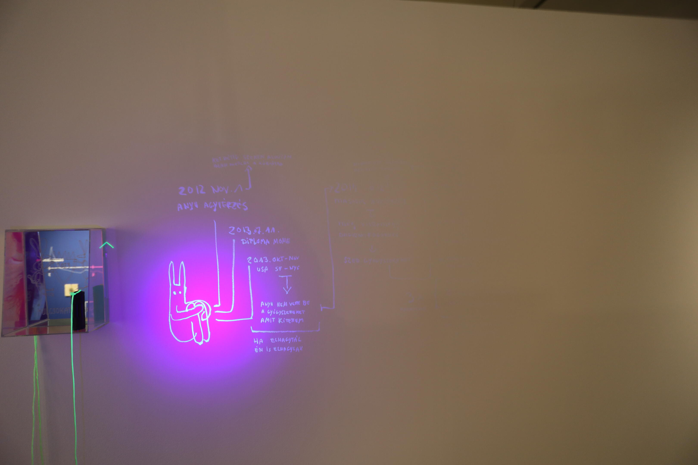
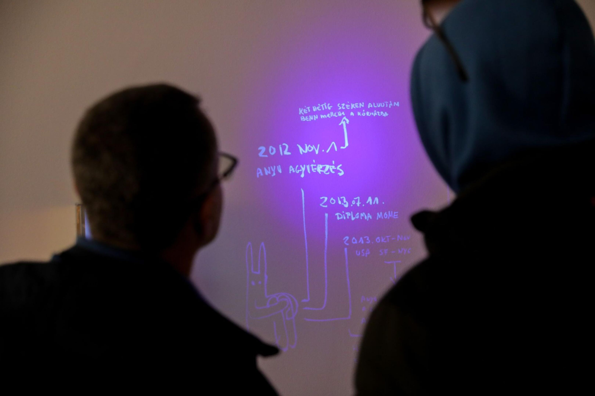

<!-- {
    "img": "projects/invisible_journey-2023/4G0A1740.JPG",
    "title": "Invisible Journey (2023)",
    "desc": "A pilgrimage within myself: mapping the past."
} -->

# Invisible Journey (2023)
**Pannonhalma 04.05.2023 - 11.11.2023**

A pilgrimage within myself: mapping the past. I look back on my own life from the present, a journey in which I am being aided by a professional, a therapist. With this help, I am unraveling my memories and trying to put them in order. The imprints of the inner journey (back) are invisibly displayed on the wall; an ultraviolet lamp gives visitors insight into the work in progress.

Material: UV paint, UV lamp, mirror box with sign.

This project was exhibited together with

* [Olga Kocsi as Holy Olga (2023)](/c/projects/olga_kocsi_as_holy_olga-2023)
* [Rákospalota-Pannonhalma Pilgrimage 2023](/c/projects/raakospalota_pannonhalma_pilgrimage-2023)

## [Back to projects](/c/projects)