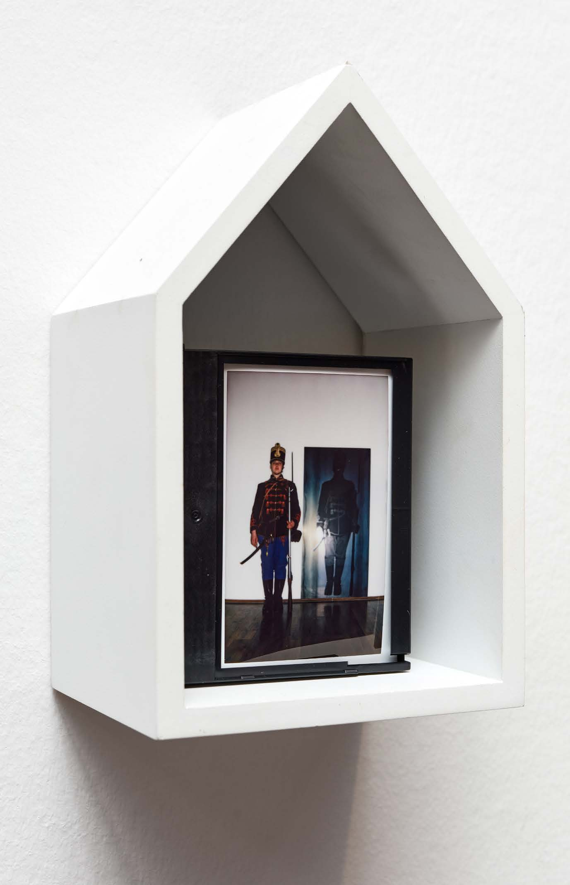
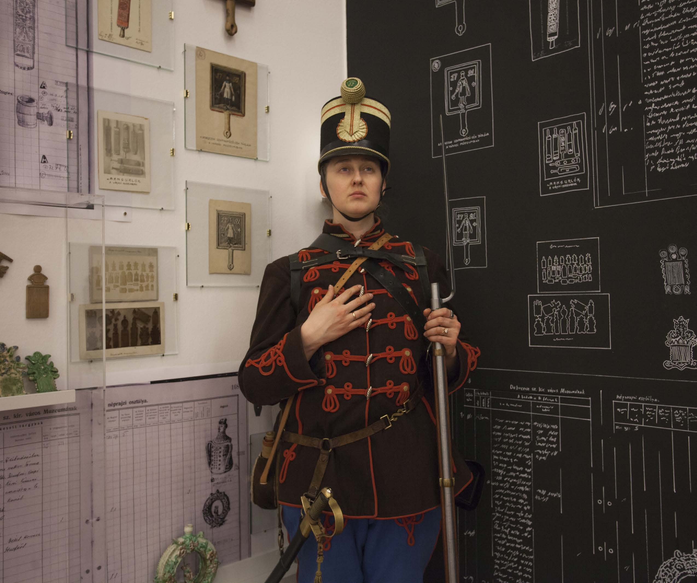
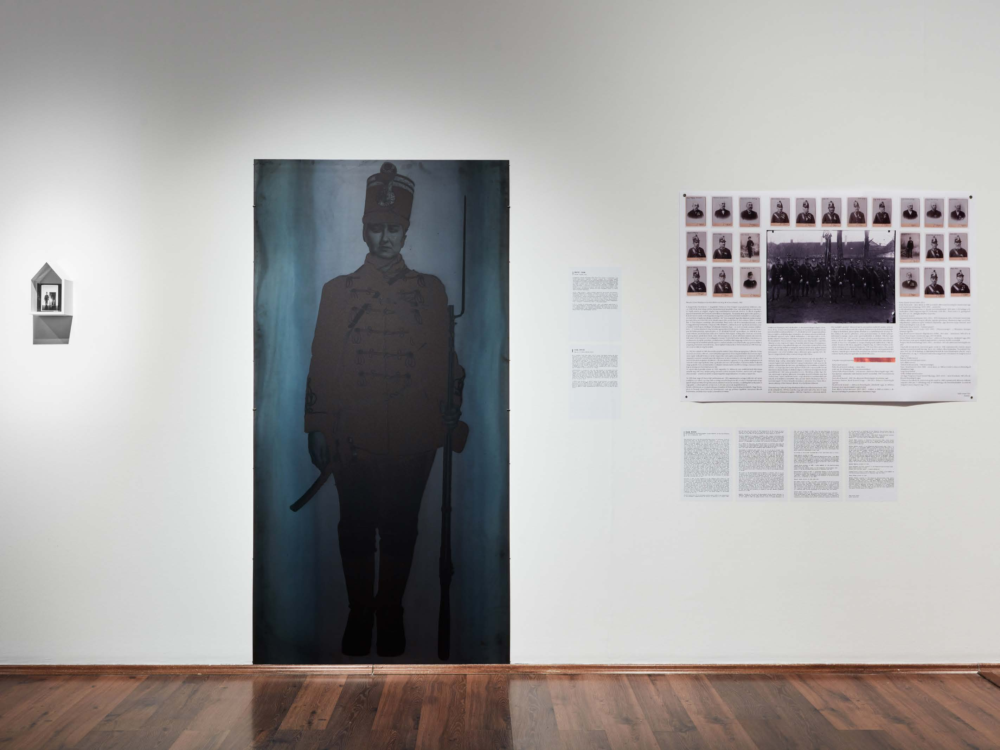

<!-- {
    "img": "olga_as_a_soldier_museum_guard-2022/katona_olga_02.jpg",
    "title": "Olga as a Soldier Museum Guard (2022)",
    "desc": "A surreal experience of donning a 19th-century military uniform in a museum environment, blurring the lines between history, identity, and documentation."
} -->

## Olga as a Soldier Museum Guard
**Hol nem város**, MODEM, Debrecen, Hungary, 2022

In Debrecen at a workshop for the **Onceuponacty** exhibiton *Viola Anna Szabó* told us about the museum guards who were dressed up in soldiers’ uniforms and protected the objects of the museum. This story captured my imagination at once. In the opening decade of the city museum, the veteran freedom fighters of the 1848 revolution were employed as museum guards, dressed up in their re-sewn uniforms. Photographs were taken of them. When I've been told that the museum still had one such replica uniform, I immediately asked to borrow it and put it on as a costume replaying the story of the museum guard soldiers. I was interested in that surreal situation, what it might feel like to exist in a museum environment in a military uniform, almost as an object on display and to appear in men’s clothing as a woman.

Unfortunately, it turned out soon that the uniform in the museum didn’t fit me in size. I gave up on my idea, but the next day I was told that, thanks to a wonderful coincidence, someone had offered Déri Museum a full 1848/49 military uniform, which was used at traditional events. I was very happy with the news. I met Sándor Lukács, who owned the replica uniform and he became my benefactor. We discussed that he would bring me the whole set the following week. He helped me to dress up in the uniform and he lent it to me for the photo shoot.

I had my photo taken, in which I appear in the uniform, and printed on a steel plate, as if it was an enlarged, archived silver image. Next to the image another photograph can be seen, in which I appear as the museum guard. With the motif of repetition and as a form of documentation, I refer to my other work with an image in image representation, [the exhibition about the work of Lajos Zoltai](/c/projects/zoltai-2022).

## [Back to projects](/c/projects)