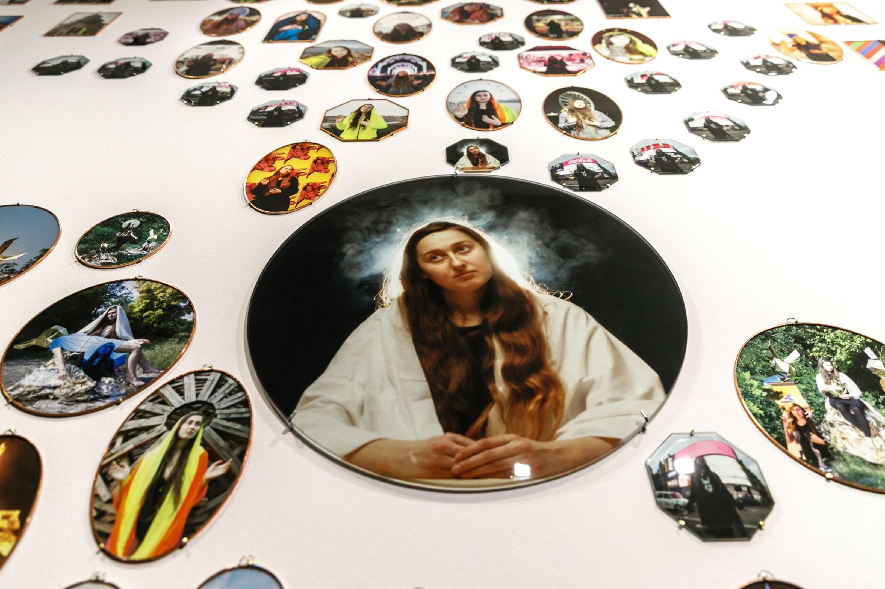
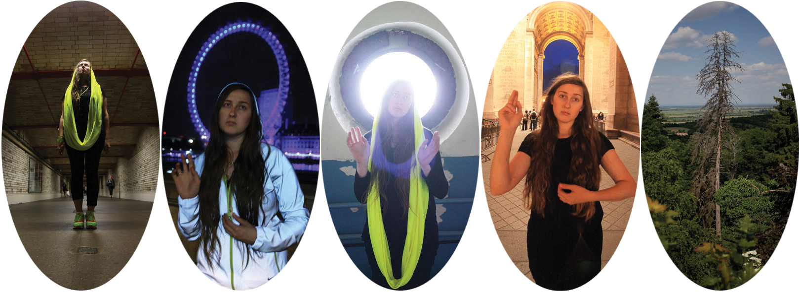
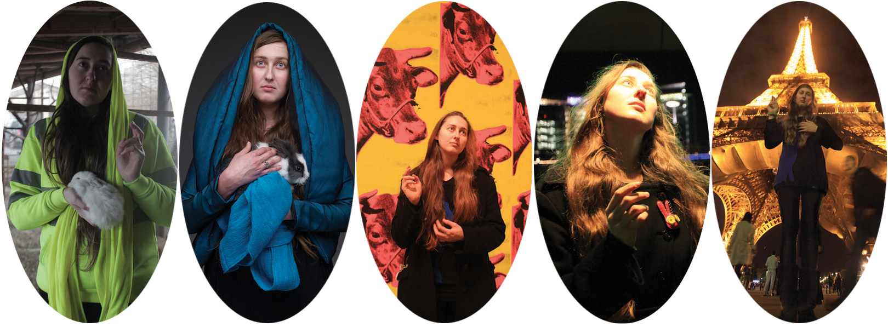
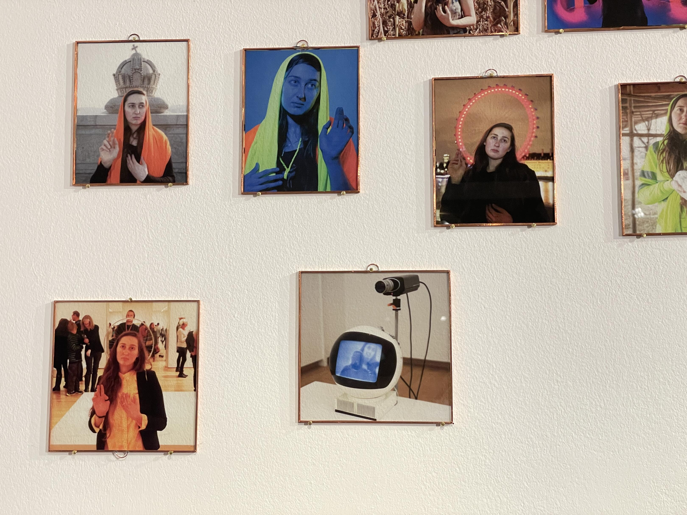
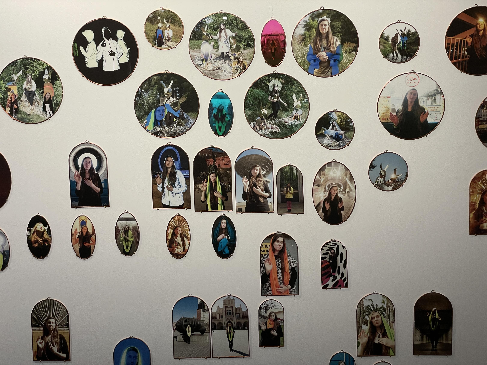

<!-- {
    "img": "projects/olga_kocsi_as_holy_olga-2023/DSC04655.jpg",
    "title": "Olga Kocsi as Holy Olga (2023)",
    "desc": "Holy Olga glass images overlaid on Csontváry's Pilgrimage to the Cedars in Lebanon."
} -->

# Olga Kocsi as Holy Olga (2023)
**Pannonhalma 04.05.2023 - 11.11.2023**

Olga Kocsi’s work is based on Csontváry’s Pilgrimage to the Cedars in Lebanon. She places her glass images on the outlines of the painting. Almost without exception, the pictures depict herself – in a series of holy images embedded in today’s urban environment. The group of images evoke the kitschy souvenirs associated with pilgrimages, which usually do not remind us of the spiritual content of the pilgrimage, but – similarly to selfies – merely record the fact of our appearance (existence) at a given location. Olga Kocsi’s works are "self-souvenirs" made in the age of selfies.

> Over the past century, countless interpretations have been given to Csontváry’s work: the painting is a hidden self-portrait or a world model. At the same time, it has become a part of our popular culture over the past sixty years: its spirituality as a poster, as a visual commonplace, has faded. Olga Kocsi’s work – the center of which is not only herself, but also the image of one of the millennium pines in Pannonhalma, which dried up due to climate change – appropriates the painting and fills the areas between reality and fiction, the Self, kitsch and art.

József Mélyi

Olga Holy, the travelling icon, started in 2010 by chance, and then took on a life of her own. A classmate of mine, Adrienn Benedek, asked me to be Jesus in a paraphrase she photographed. Seeing my face in the resulting photo as I had never experienced it before was curious. I’ve begun to use the picture myself, and when visiting cities, as souvenirs, I took photos of myself.

<mdcompare ls="olga_kocsi_as_holy_olga-2023/olga_jesus_rembrandt.jpg" rs="olga_kocsi_as_holy_olga-2023/olga_jesus_olga.jpg" ></mdcompare>

This project was exhibited together with

* [Invisible Journey (2023)](/c/projects/invisible_journey-2023)
* [Rákospalota-Pannonhalma Pilgrimage (2023)](/c/projects/raakospalota_pannonhalma_pilgrimage-2023)

## [Back to projects](/c/projects)