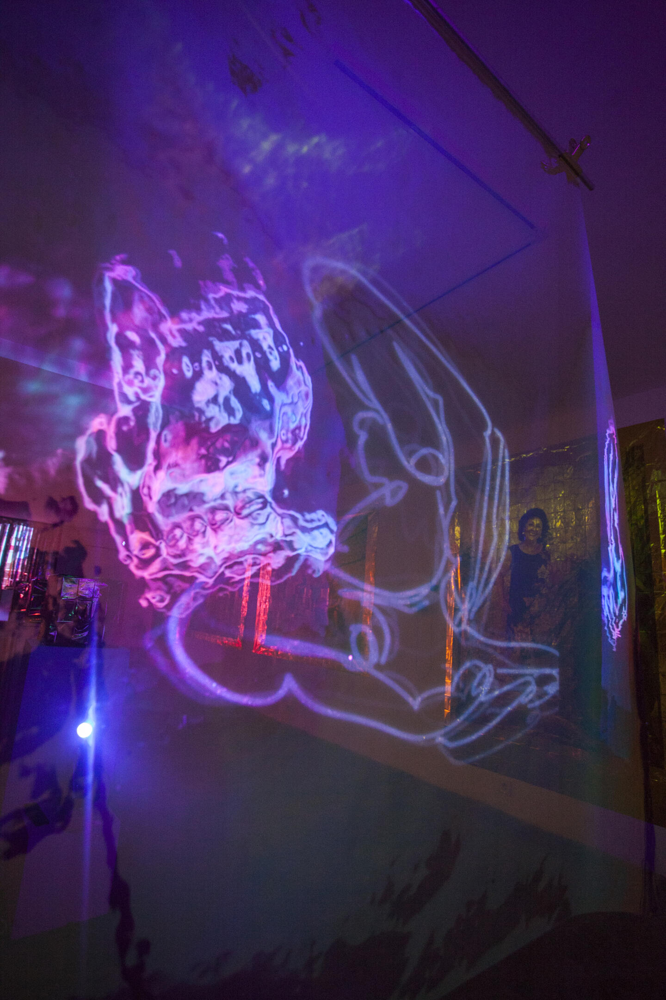
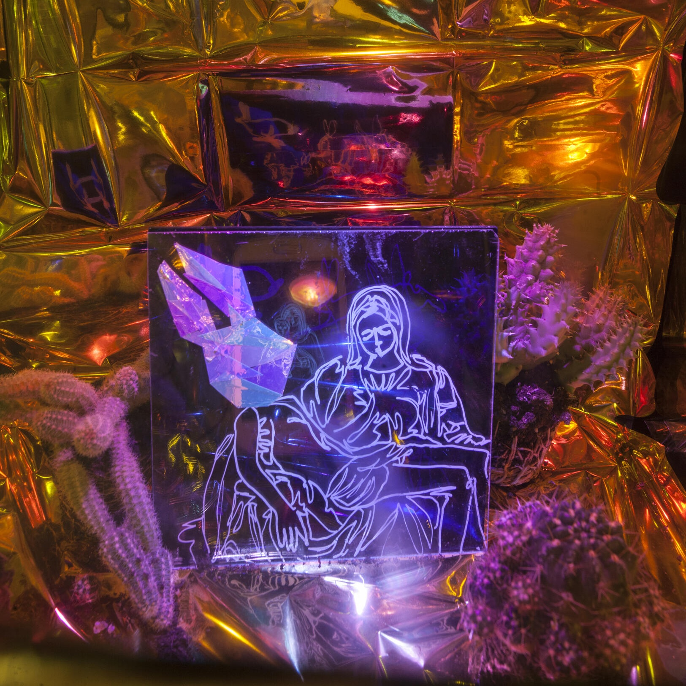
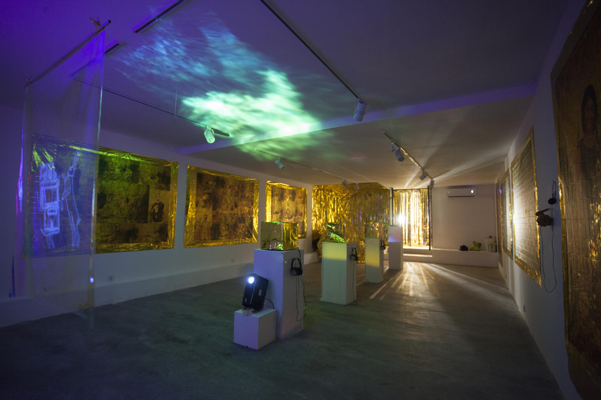
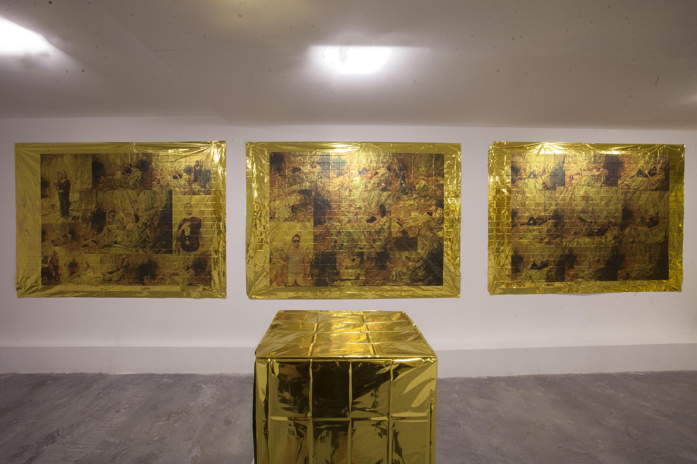
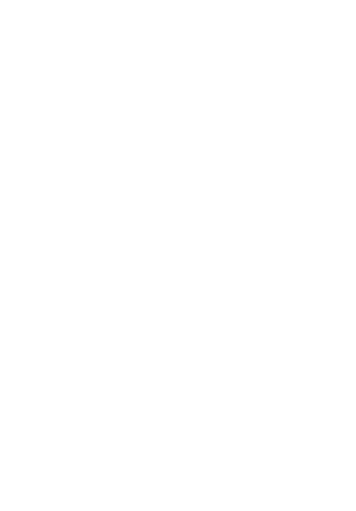
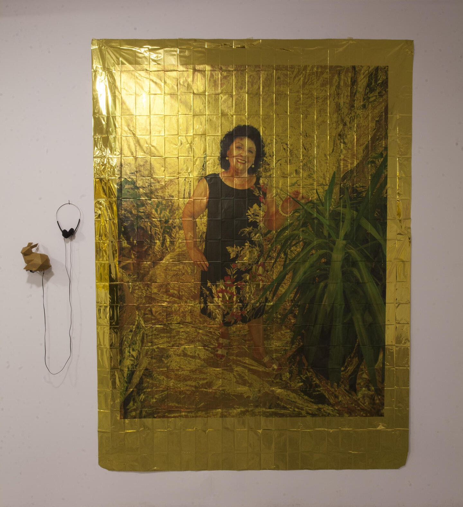
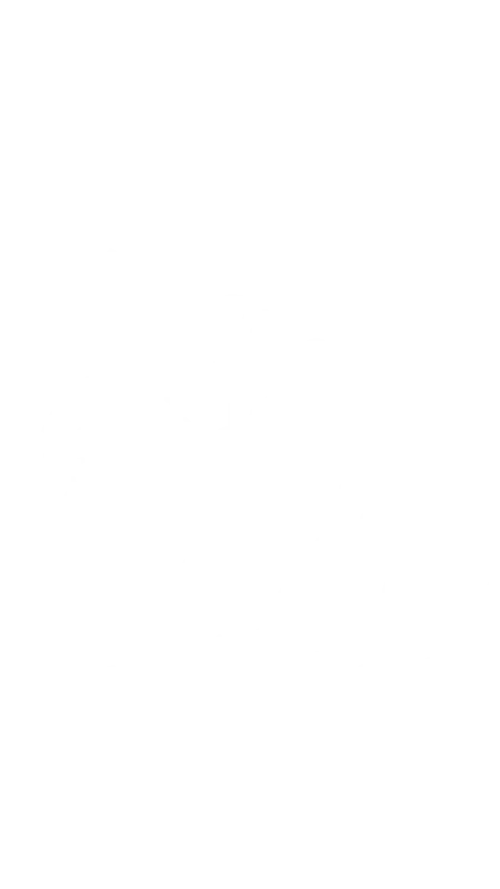
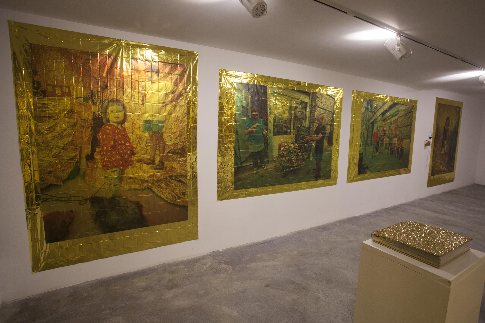
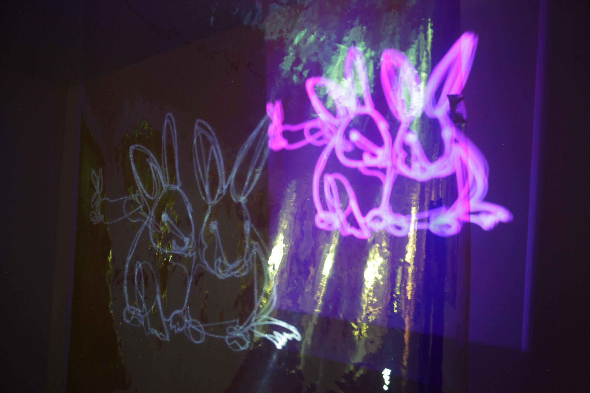

<!-- {
    "img": "raakooczi_legendarium-2020/003kocsi_olga_rakoczilenegdarium.jpg",
    "title": "Rákóczi Legendarium",
    "desc": "A golden book of legends and personal stories. The heart of Rákóczi Square in a year-long visual journey."
} -->

# Rákóczi Legendarium
**ISBN Book+Gallery**, Budapest, Hungary, 2020

The project is a continuation of the installation and event series at the **TODO: LINK: RákóCity project** room, which once operated on the intersection of Rákóczi tér and Víg utca in 2019. During the exhibition last summer, Kocsi got to know the area’s residents and bystanders, collecting their personal, sometimes funny, sometimes deeply touching or interesting stories. Polaroid and digital images of visitors and delinquents were also taken in a gold-covered massage sofa as a central element of the installation.

A sparkling golden book has been made, enclosing all befriendings and the development of relationships at the corner of Rákóczi Square. The exhibition in the ISBN Book+Gallery, taking place a year later, draws on the legends collected the preceding year, about the joint pancake baking and lemonade drinking in Víg utca. It presents the photo book compiled during the **TODO: LINK: RákóCity project**. Visitors can sample the visual imprint gathered over the course of that year, view or listen to small but significant details of life stories and meditate in the gold-covered massage sofa.

**1.** RÁKÓCZI LEGENDARIUM  
**2.** MARYANN  
**3.** ALEXINE  
**4.** MARYANN  
**5.** ANIMMATION - radio interview  
**6.** MASSAGE SOFA  
**7. - 12.** GOLDEN PORTRAIT  
**13.** MARCSI

## MARYANN

### English

### Hungarian (Original)

Well, I have had... Well, I think everyone likes to perceive they have had an interesting life. I guess mine has been one I’ve been happy with. I was a high level executive in health care where not many women were at that level.

Azt hiszem, mindenki azt szeretné gondolni, hogy érdekes élete volt. Szerintem az enyémmel elégedett vagyok. Az egészségügyben vezető pozícióban dolgoztam, nem sok nő volt ilyen szinten

And I did that for many years in America. And then I retired early. And then I became a master gardener. I was interested in horticulture and had a very big garden. It was all terraced, I did it all myself, and then my husband and I traveled a lot and we came to Hungary in 2007, the first time. And actually we came because we came for dental care and then we became associated with a dental clinic here.

Évekig ezt csináltam Amerikában. És elég korán visszavonultam. Aztán képzett kertész lettem. Érdekelt a kertészet és nagyon nagy kertem volt. Teraszos volt, mindent magam csináltam, majd a férjemmel együtt sokat utaztunk, és először 2007-ben jöttünk Magyarországra. Valójában fogorvosi kezelésre érkeztünk, és akkor kapcsolatba kerültünk egy itteni fogászati klinikával. 

But the first time, I admit when I came here, I didn’t like it at all because... I was not frightened, but it was not very welcoming. And this was before there were many tourists. And then as we got to know the Hungarian people more, we realized the guard that’s up. But it’s also very difficult for people from the West to understand the caution that people in the East have from communism. I mean, I feel that’s my outsider perspective, that there is still especially with older people, there’s a lot of that left over.

De beismerem, amikor először idejöttem, egyáltalán nem tetszett, mert ... hát, nem voltam megijedve, de nem volt valami barátságos hely. És ez még a sok turista előtt volt. De amikor már jobban megismertük a magyar embereket, rájöttünk, hogy nagyon óvatosak. A nyugati emberek számára nagyon nehéz megérteni a kelet-európai emberek kommunizmusból eredő óvatosságát. Úgy értem, hogy így látom kívülállóként, és ez még mindig jellemző, különösen az idősebb emberekre. 

And we’ve seen a lot of changes since we’ve been here. Of course, many good and some that are very concerning now politically in terms of the world and the influence of this government on the rest of the world. And yet I also see there is more of a renaissance of younger, politically active people here, which I think is very healthy. Of course, it’s in the city.

Sok változást láttunk mióta itt vagyunk. Természetesen sok jót, de néhány aggasztót is, politikailag globális szinten, és a mostani kormánynak a hatását a világ többi részére. Ennek ellenére látom, hogy itt azért észlelhető a fiatal, politikailag aktív emberek reneszánsza, amely szerintem nagyon egészséges. Természetesen ez a városban van jelen. 

And so those were the first few phases of my life. And now I’m transitioning to writing, and I have two books that I’m writing and I do technical writing. I’m in my 60s, but I feel the happiest and the healthiest I’ve ever been. But I think as women age, they feel a real sense, of course. Many feel that younger and explore themselves. The more you do (like you are) the more you understand who you are and your ability to evolve and explore new things.

Ezek voltak az életem első szakaszai. És most írással foglalkozom, két könyvet írok, és technical writing-gal (műszaki szakszövegírással) is foglalkozom. A hatvanas éveimben járok, de boldogabbnak és egészségesebbnek érzem magam, mint valaha. De azt hiszem, hogy a nők az kor előrehaladtával megérzik az lényeget. Sokan ezt már fiatalabban érzik, és felfedezik saját magukat. Minél többet csinálod (mint Te), annál jobban megérted, hogy ki vagy, és képes vagy fejlődni és felfedezni új dolgokat.

Many women can’t, yet I believe as they get in their 40s, 50s and 60s, they become very, very powerful. I believe the future of the world is with women. I do. It’s true. Women are much more compassionate, negotiable. Their whole being is oriented to problemsolving, nurturing, building, growing. Certainly some of that has to do with the family. But I think that women, especially women artists, I have several friends that are women artists, tend to express themselves in very dramatic ways, maybe a little bit differently than men. Of course, men are like that. Of course, I’m drawn to women artists so anyway

Sok nő nem képes erre, mégis azt hiszem, hogy amikor elérik a 40, 50, 60 éves kort, nagyon erőssé válnak. Úgy gondolom, hogy a nőké a világ jövője. Tényleg. Ez igaz. A nők sokkal együttérzőbbek, kompromisszumkészebbek. Az egész létük a problémamegoldásra, gondoskodásra, építkezésre, növekedésre irányul. Természetesen ennek részben a családhoz van köze. De azt hiszem, hogy a nők, különösen a női művészek - több barátom van, aki női művész - drámaibb módon fejezik ki magukat, talán kissé másképp, mint a férfiak. Persze a férfiak is ilyenek, de természetesen a női művészek vonzanak igazán.

And being in Hungary is very exciting at this age for us to have made this change because it is a challenge to be older and to do this, to not speak the language. Though I’m trying. But I’m very, very happy here. But we do go back and forth and we live in a very beautiful area. It’s dramatic in terms of going to the mountains and then coming to the city. It allows a lot of contrast and provokes a lot of thinking and growing on my own part. And I’m happy to be in this district and to meet people like you because it gives me more confidence in the future and the city. So I’m happy to know you. I’m happy you’re doing this.

Nagyon izgalmas pont ebben a korban Magyarországon lenni, hogy bevállaltuk ezt a változást, mert kihívás idősebben ezt megtenni, ha nem beszéljük a nyelvet. Bár próbálkozom. De nagyon, nagyon boldog vagyok itt. De sokat jövünk megyünk, és egy nagyon szép helyen élünk. Ami nagyon drámai különbség abból a szempontból, hogy az ember a hegyekbe megy, utána vissza a városba. Nagyon sok kontrasztot ad, és gondolkodásra, személyes fejlődésre ösztönöz. És örülök, hogy ebben a kerületben vagyok, és olyan emberekkel találkozhatok, mint te, mert ez nagyobb bizalmat ad nekem a jövővel és a várossal kapcsolatban. Örülök, hogy megismertelek. Örülök, hogy ezt csinálod.

## ALEXINE

### English

### Hungarian (Original)

So in Budapest we were living on József road and it was so funny because all our Hungarian friends were like 'district VIII? But where?' 'Which side of the road?' And we’re like, 'well, we’re on the other side'. And they were like 'Ah that's cool, that's cool'. And I was like 'What do you mean'? And they were like 'because, you know, the other side of the district VIII is really bad'. And I was like 'what?' And so we stayed there for a year.

Budapesten a József körúton éltünk, és annyira vicces volt, mert az összes magyar barátunk azt mondta, “Mi, a nyolcadik kerületben? De hol? A körút melyik oldalán?” És mi mondtuk, hogy a másik oldalán. És akkor mondták hogy “ah, az oké, az oké.” Kérdeztem, hogy miért? És azt válaszolták, “Mert, tudod, a nyolcadik kerület másik oldala nagyon rossz.” Kérdeztem, hogy miért? És ott maradtunk egy évig.

And then we actually bought a flat here on Rákóczi square. And it was so beautiful. It was so amazing. And I just saw it from the street and a guy told me... he was, whatever, it was all really funny, like really weird. We just met a guy on the street. I wanted to buy an X because I didn’t have too much money, and I had spotted one on Rákóczi square. And he came out of the building and I asked him, where can I talk with the 'házas... házsas...' *\[attempts at pronouncing a difficult Hungarian word\]* or whatever. And he told me, 'no, no, you can’t. But I’m a real estate guy.' And I was like 'yeah right'! He was just really dodgy. And he said, 'you know, I know there's a flat for sale right here.'

Végül itt vettünk egy lakást a Rákóczi téren. Olyan gyönyörű volt, olyan csodálatos. Az utcán megláttam, és a srác azt mondta nekem... mindegy, ez mind nagyon vicces volt, nagyon furcsa. Szóval találkoztunk egy sráccal az utcán. X-t akartam vásárolni, mert nem volt túl sok pénzem, és a Rákóczi téren találtam egyet. És ez a srác kijött az épületből, és megkérdeztem tőle magyarul, hogy beszélhetek-e a házassal..házsassal ... vagy mittudomén. És azt mondta, nem, nem, nem lehet. De én ingatlanügynök vagyok. Ja, persze! Nagyon gyanús volt. És azt is mondta, hogy van itt egy eladó lakás.

And then he showed me this beautiful art nouveau building and I walked in and there was a Romani family in it and they were practically laughing at me for wanting to buy that place. And yeah. I mean, I fell in love right away. It was like, ho ho ho. And then we moved in, to the horror of all of my friends and everybody. But it was an excellent idea, it was so amazing Rákóczi square marketplace you know, I knew everybody and there were all these 'bácsis' and 'nénis' *\[uncles and aunts\]* Fridays and Saturdays who came in from the countryside bringing beautiful produce and flowers and things.

Aztán megmutatott nekem egy gyönyörű szecessziós épületet, bementem, és ott volt egy roma család, és gyakorlatilag nevettek, hogy meg akarom venni ezt a lakást. És igen, azonnal beleszerettem. Olyan volt, ho ho ho. Aztán beköltöztünk, az összes barátom és mindenki megrökönyödésére. De kiváló ötlet volt, olyan csodálatos a Rákóczi téri csarnok, tudod, ismertem mindenkit, és ott voltak bácsik és nénik péntekenként és szombatonként, akik vidékről jöttek, és gyönyörű terményeket hoztak, virágokat és egyebeket.

And because I was pregnant, so they were giving me stuff all the time. And then, you know, I took pictures of almost everybody in the market because they knew me so well. And they knew I had a camera, and they didn’t mind. And so I have like pictures of everybody at the time. But I don’t know if they are still there, the Chinese shop, they were really unfriendly. They were not friendly. No, they were not friendly. And we had a theory. I think it was a I think it’s like a kind of I don’t know if I should say that, but I think it’s a mafia money-loundering. Exactly. They’re always coming with Mercedes and there was nobody ever buying anything in that shop, you know. Everything is overpriced and ridiculous, you know, so. And they were not friendly. That’s a shame because, you know, I was so excited to have a Chinese shop right there.

Mivel terhes voltam, állandóan mindenfélét ajándékoztak nekem. És akkor, tudod, szinte mindenkit lefényképeztem a piacon, mert annyira jól ismertek engem. Tudták, hogy van egy fényképezőgépem, és nem zavarta őket. Így van akkoriból mindenkiről képem. De.. nem tudom, hogy még mindig ott van-e a kínai üzlet, ők nagyon barátságtalanok voltak. Nem voltak barátságosak. Nem, nem voltak barátságosak. Volt egy elméletünk. Nem tudom, hogy ezt mondanom kellene-e, de szerintem ez egy pénzmosó maffia volt. Mindig Mercedesszel jöttek, és senki sem vásárolt semmit a boltban, minden nevetségesen drága volt. És nem voltak barátságosak. Ezt sajnálom, mert tudod, eleinte nagyon örültem, hogy volt ott egy kínai üzlet.

But yeah. I mean, what else... I can’t tell you much else. I mean, it was just. Yeah, I really loved living on Rákóczi square a lot, and I moved after that to Népszíház street and it was still fine. But I really missed being right on the square, like, it was so amazing, like the marketplace was my cornershop. I used to go there every day and it was fabulous, really fabulous. It’s a fabulous place to live, Rákóczi square. It’s 'ARANY, arany Rákóczi tér' *\['GOLDEN, golden Rákóczi square'\]*.

Ok I think I’m done, I’ve said everything I could tell.

De igen. Szóval mi más van... Nem tudok mást mesélni. Igen, valóban nagyon szerettem a Rákóczi térnél élni. Utána a Népszínház utcába költöztem, és az is jó volt. De nagyon hiányzott, hogy közvetlen ott volt a tér, mert olyan csodálatos volt, a csarnok volt a sarki boltom. Minden nap mentem. Csodálatos, csodálatos hely a Rákóczi tér. ARANY, arany a Rákóczi tér.

Oké, azt hiszem, ennyi, mindent elmondtam, amit tudtam.

**\[Olga\]** You said something about the prostitutes, what was that sentence? I really liked it. There were a lot of women here? They were really cute and something?

**\[Olga\]** Mondtál valamit a prostituáltakról, mi volt az? Nagyon tetszett. Nagyon sok nő volt itt? Nagyon aranyosak voltak, vagy?

Yeah, we saw them arrive periodically and they always looked very fresh and beautiful and cute when they arrived. And within three months they looked really sick and it was really sad. But the nice thing, whether they were healthy or not healthy, that they were super friendly and... they’re just women, they’re women that have to work with their bodies you know, like and they were I mean, I never had any problems, on the contrary, they were nice. They were a good influence, I would say almost. I would say also like, I think we were particularly safe living on the Rákoczi square because we were part of the environment, so to speak. You know, we’re part of the environment. And so nobody would have ever hurt us. You know what I mean, it was not at all unsafe, like my friends said, on the contrary, it was super nice. I never had any problems.

Igen, láttuk, hogy időnként érkeznek, és mindig nagyon frissnek, gyönyörűnek és csinosnak tűntek, amikor megérkeztek. De három hónapon belül betegnek néztek ki, nagyon szomorú volt. De az jó, hogy akár egészségesek voltak, akár nem, mindig szuper barátságosak voltak és... csak nők, nők, akiknek a testükkel kell dolgozniuk. Soha nem volt gond velük, éppen ellenkezőleg, kedvesek voltak. Majdnem azt mondanám, hogy jó befolyással voltak a környékre. Azt is mondanám, hogy szerintem mi különösen biztonságban éreztük magunkat a Rákóczi téren, mert úgymond a hely része voltunk. És így senki sem bántott volna bennünket. Tudod, hogy mire gondolok, egyáltalán nem volt veszélyes, mint a barátaim mondták, éppen ellenkezőleg, nagyon jó volt. Nem volt semmi gond.

## MARYANN

### English

### Hungarian (Original)

You know, it’s interesting, I grew up in the 60's, a time of great revolution, and my parents supported it. And I was fortunate for that. My mother was quite radical and she was a feminist before it was chic to be a feminist. And so I fortunately was raised under that. But it’s different now in that I think there was a period of decades where there just wasn’t enough radical behavior in the world. And now there will be, because I think you, your generation, as well as the young people, will just not accept certain things anymore. There is a line and no more. And that’s what there needs to be. It needs to be dramatic.

Tudod, érdekes, én a 60-as években nőttem fel, nagy forradalmak idején, amit a szüleim is támogattak. És ebből a szempontból szerencsés voltam. Anyám meglehetősen radikális volt, és feminista volt, még azelőtt, hogy menő volt feministának lenni. Szerencsére ebben nőttem fel. De most más a helyzet. Szerintem volt egy időszak ami évtizedekig tartott, amikor a világban egyszerűen nem volt elég radikális viselkedés. És most lesz, mert azt hiszem, te, a te generációd, valamint a fiatalok, többé nem fognak bizonyos dolgokat elfogadni. Van egy határ. És erre szükség van. Megrázónak kell lennie.

But women, I can’t tell you enough how... I didn’t have children. I think a lot of women will say, well, they come into their own where they don’t need to say yes to everyone. And, you know, in my world, it was I didn’t say yes to all that. I didn’t have to say yes to all the men that were telling me what to do because they thought they knew better in business when in fact, I did. I did what I wanted anyway. But they knew I knew they couldn’t challenge me. Because I knew that they knew that I knew what I was doing. And they were frightened of my ability and my influence on the organization. But women just have so much of a strength in their soul. If they harness this the earlier, the better. But there’s no stopping you. None. My mother was a zero population growth person and she felt that the world was not suitable for children. And so I never even had any biological drive. Never. But I understand it. I think sometimes now I feel, you know... I don’t know. I’ve never regretted it. Ever, ever.

De a nők, nem tudom jól kifejezni, hogyan... nincs gyerekem. Szerintem sok nő azt fogja mondani, hogy akkor érvényesülnek, amikor nem kell mindenkinek igent mondani. És tudod, nálam meg az volt, hogy egyáltalán nem mondtam igent mindenre. Nem kellett igent mondanom azoknak a férfiaknak, akik megmondták nekem, mit kell tennem, mert azt hitték, hogy jobban értenek az üzlethez mint én, amikor valójában én értettem hozzá jobban. Azt csináltam, amit akartam. De tudták, hogy tudtam, hogy nem tudnak versenyezni velem. Mert tudtam, hogy tudják, hogy tudom, hogy mit csinálok. És féltek a tudásomtól és a befolyásomtól a cégnél. De a nőknek nagy lelki erejük van. Minél korábban felfedezik, annál jobb. Nem lehet megállítani téged. Anyám a zéró népességnövekedésben hitt, és úgy érezte, hogy a világ nem jó hely a gyerekeknek. Így soha nem volt semmilyen biológiai késztetésem. Soha. De megértem. Néha azt hiszem, úgy érzem, tudod... nem tudom. Soha nem bántam meg. Soha. 

# TODO: PRESS

## [Back to projects](/c/projects)