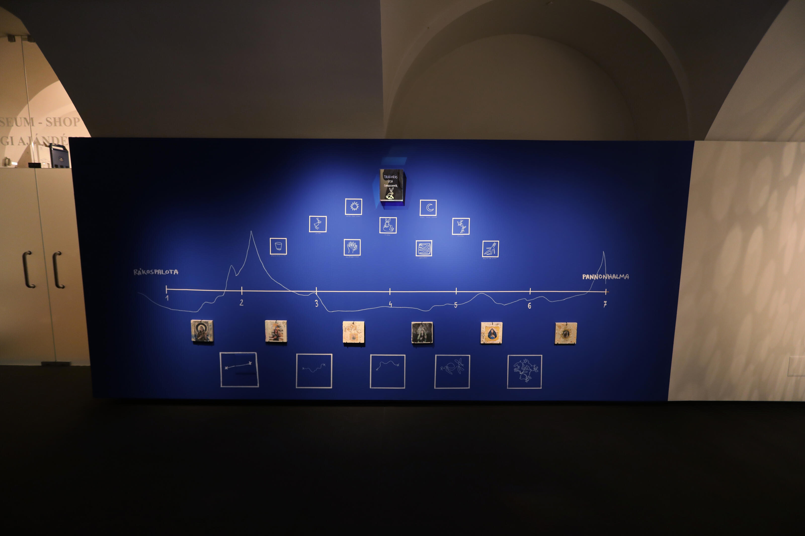

<!-- {
    "img": "projects/raakospalota_pannonhalma_pilgrimage-2023/main.jpg",
    "title": "Rákospalota-Pannonhalma Pilgrimage (2023)",
    "desc": "Pilgrim from Rákospalota to Pannonhalma"
} -->

## Rákospalota-Pannonhalma Pilgrimage (2023)
**Pannonhalma 04.05.2023 - 11.11.2023**

If we assume a distance between the self and the world, that could be traversed in countless ways. The path is untrodden, the signposts are deceptive, everyone outlines their own map. Most drawings or spaces, understood as labyrinths, can be divided into two parts: a filled and an unfilled one. There exists, therefore, the obstacle and the space left free. From this point of view, the squares drawn on paper are elements that allow for wandering and at the same time serve as maps.

