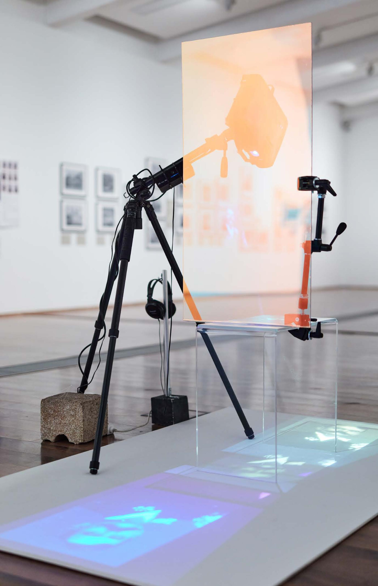
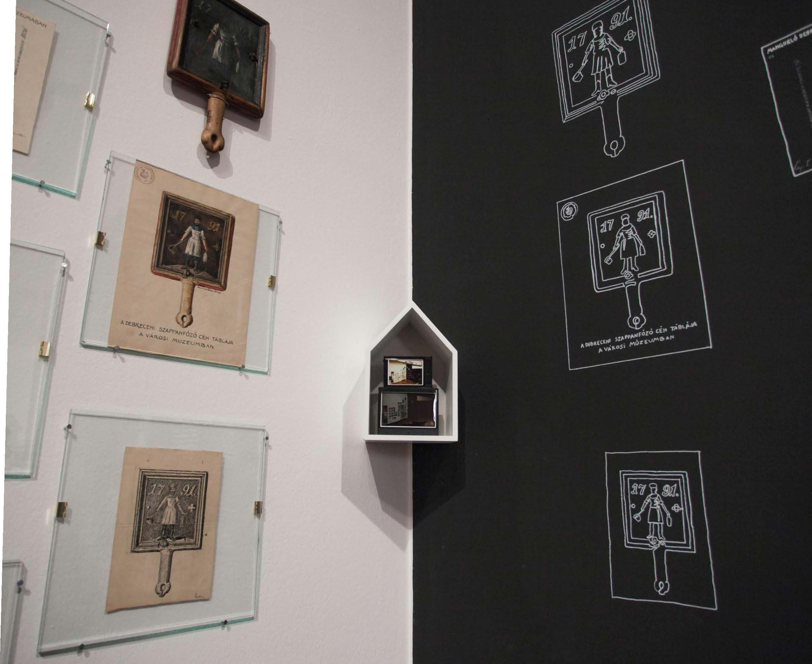

<!-- {
    "img": "zoltai-2022/zoltai02.jpg",
    "title": "The Essence of Lajos Zoltai (2022)",
    "desc": "Documentation, reproduction, collection"
} -->

# The Essence of Lajos Zoltai
**Documentation, reproduction, collection**  
**Hol nem város**, MODEM, Debrecen, Hungary, 2022

The work of Lajos Zoltai, the first "museum guard" of the city museum of Debrecen, deserves attention, as his meticulous, careful existence was a sparkling phenomenon. With incredible diligence he collected and researched archaeological artifacts and everyday folk objects hidden in the ground. He highlighted, described, preserved and collected objects, sights, buildings, everything that was just about to past. The story and work of Zoltai, which we became familiar with at the workshop, was very exciting for me. I would also like the audience to appreciate this devotion, the enthusiasm and the blazing fire that drove this wonderful man who recorded and documented so much in his life. Only a small part is displayed from his repetition, which was an important element of his work. He often drew, painted and photographed the same objects: documentation, reproduction, and collection are the essence of Lajos Zoltai. 

The objects on the white left wall come from the collection of Déri Museum, the reproduction of it can be seen on the black right wall, and a small image appears in the middle as a documentation of the entire installation. In the video installation, the pictures of Lajos Zoltai are narrated by Anna Viola Szabó’s texts, which we can hear in Noémi Szántusz’s interpretation.

Related work: [Olga as a Soldier Museum Guard (2022)](/c/projects/olga_as_a_soldier_museum_guard-2022)

## [Back to projects](/c/projects)
